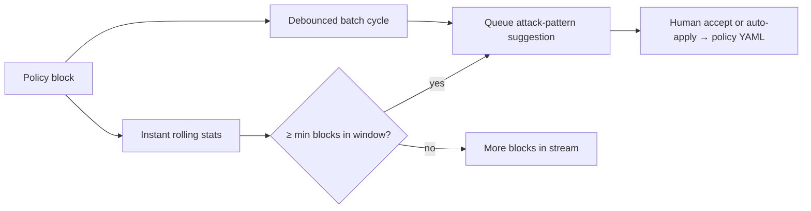

# MCP Guardian

**Runtime security, cost governance, and health monitoring proxy for MCP infrastructure.**

[](https://www.npmjs.com/package/@mcp-guardian/server)
[](https://www.npmjs.com/package/@mcp-guardian/server)
[](https://glama.ai/mcp/servers/rudraneel93/mcp-guardian)
[](https://www.typescriptlang.org/)
[](https://github.com/modelcontextprotocol/typescript-sdk)
[](LICENSE)
[](https://github.com/rudraneel93/mcp-guardian/actions/workflows/ci.yml)

## Proven under attack (v2.9.1)

Evidence is split into four layers — use the right source when quoting numbers:

| Layer | Harness | Trust for CI / procurement |
|-------|---------|----------------------------|
| **Repo eval** | `pnpm eval:attack-learning:long` → [`reports/attack-learning-eval/metrics.json`](reports/attack-learning-eval/metrics.json) | **Primary** — reproducible, same code path as `instant-attack-learning` tests |
| **Adversarial harness** | [`adversarial-harness/run-all.sh`](adversarial-harness/run-all.sh) → [`reports/adversarial-harness/`](reports/adversarial-harness/) | **Primary (live proxy + parity)** — **154/154** corpus attacks, **84/85** evasion, **26/26** Node stdio integration; Python offline mirror of TS sync pipeline ([`POLICY_PORT_GAPS.md`](adversarial-harness/python/POLICY_PORT_GAPS.md)) |
| **Enterprise 5-scenario sim** | [`reports/enterprise-attack-sim/`](reports/enterprise-attack-sim/) (`enterprise-attack-simulator.ts`) | **Synthetic** — 330 modeled attacks, May 2026 package; open [dashboard HTML](reports/enterprise-attack-sim/attack-simulation-dashboard.html) |
| **180-min SCA sim** | [`sca/`](sca/) (`live-proxy-attack-simulator.ts`, `CHART_*.png`) | **Synthetic** — 349k+ request escalation narrative; not `metrics.json` |

**v2.9.1** leads with **CI-gated adversarial harness** evidence (**154/154** corpus, **84/85** evasion, **adv-066** tracked), **four-layer README evidence** (repo eval vs harness vs enterprise sim vs SCA), and **[enterprise attack-sim](reports/enterprise-attack-sim/)** reports; continues per-block instant attack learning, dashboard RBAC, streaming response inspection, and bounded audit queue. See [CHANGELOG.md](CHANGELOG.md).

### Instant vs batch (long-run, repo eval — verified)

`pnpm eval:attack-learning:long` — **5003** simulated blocked `tools/call` events, **~4.9h** attack stream (2–5s inter-arrival, 30s batch debounce).

| Metric | Instant learning | Batch-only (debounced) |
|--------|------------------|-------------------------|
| Suggestions queued | 5 | 5 |
| Avg blocks to first suggestion | **3.0** | **1000.6** |
| Median time-to-suggestion | **41 s** | **~4.9 h** |

**Verdict:** Same suggestion throughput, but **instant** discovers repeat `(rule, tool)` clusters during the stream; **batch-only** defers until debounce quiet periods (~**428×** slower median discovery: 4.87h ÷ 41s). Deep dive: [Attack learning evaluation](#attack-learning-evaluation) · [summary.md](reports/attack-learning-eval/summary.md) · [docs/AI_LEARNING.md](docs/AI_LEARNING.md).



### Enterprise five-scenario sim (synthetic — May 2026)

**330** modeled attacks across finance / SaaS / cost / DPoP / healthcare scenarios. Source: [`attack-simulation-metrics.json`](reports/enterprise-attack-sim/attack-simulation-metrics.json) (not CI-gated).

| Scenario | Attacks | Block rate | Avg detection latency |
|----------|---------|------------|------------------------|
| A — Credential exfiltration | 80 | 95.0% | 36.2 ms |
| B — Prompt injection | 100 | 94.0% | 29.9 ms |
| C — Token amplification | 50 | 88.0% | 47.8 ms |
| D — DPoP replay | 25 | 88.0% | 70.1 ms |
| E — SQL injection | 75 | 96.0% | 36.9 ms |
| **Aggregate** | **330** | **93.33%** (308 blocked) | **38.8 ms** |

**0** false positives in sim · **8.9 MB** peak memory · Interactive charts: [attack-simulation-dashboard.html](reports/enterprise-attack-sim/attack-simulation-dashboard.html). Full index: [reports/enterprise-attack-sim/README.md](reports/enterprise-attack-sim/README.md).

### Adversarial test harness (live proxy + policy parity — May 2026)

Full run: `./adversarial-harness/run-all.sh` or `node adversarial-harness/run-harness.mjs`. Reports: [`reports/adversarial-harness/summary.md`](reports/adversarial-harness/summary.md) · [`analysis.md`](reports/adversarial-harness/analysis.md) · [`results.json`](reports/adversarial-harness/results.json). Harness docs: [`adversarial-harness/README.md`](adversarial-harness/README.md).

| Suite | Result | Notes |
|-------|--------|-------|
| **Corpus** (`default-policy.yaml`) | **154/154** attacks blocked · **74/74** benign + edge pass · **0** false positives | **228** fixtures on disk (151 attack + 55 benign + edge-cases under [`corpus/`](corpus/)) |
| **Evasion probes** | **84/85** blocked · **1** bypass | [`evasion-attacks.json`](adversarial-harness/evasion-attacks.json) — encoding, unicode, SSRF, shell/SQL obfuscation, tool-chain |
| **Node live integration** | **26/26** passed | Real mock MCP **stdio** + `McpProxyServer` proxy pipeline (not mocked policy) |
| **Python ↔ TypeScript parity** | **400/402** (99.5%) · **0** corpus mismatches | Python port mirrors TS **sync** `evaluate()` for offline eval; live Node tests use subprocess proxy |
| **Streaming race** | **3/3** pass | Chunk-boundary injection, concurrent writers, full-response jailbreak (`streaming-inspector`) |
| **Secret scanner** | **14/14** pass | AWS, GitHub, Slack, Stripe, OpenAI, JWT, npm, generic API keys (live `scanForSecrets`) |
| **Overall harness** | **PASS** | [`results.json`](reports/adversarial-harness/results.json) (2026-05-20) |

**Known gap (documented):** evasion probe **adv-066** — base64 obfuscation in the `search` tool (`note` field) — **bypasses** policy today (`expected=block`, `actual=pass`, `rule=allowlist`). Treat as a tracked finding, not a hidden regression.

**Proxy concurrency (measured on harness run):**

| Component | p50 | p95 |
|-----------|-----|-----|
| `AsyncSerialQueue` (CLI stdin — serializes all lines) | 2.32 ms | 2.41 ms |
| `McpProxyServer.handleClientInput` (live mock MCP stdio) | 19.37 ms | 37.01 ms |

**Design note:** CLI stdin uses a global **`AsyncSerialQueue`** (one line at a time). The proxy uses **`RequestIdLock`**: same MCP `id` serializes; distinct ids may overlap by design. The Python port is **not** identical to production TypeScript — intentional offline-eval gaps (OPA async, Redis rate limit, FP whitelist, response-body eval, shadow policy) are listed in [`adversarial-harness/python/POLICY_PORT_GAPS.md`](adversarial-harness/python/POLICY_PORT_GAPS.md). Narrative: [analysis.md](reports/adversarial-harness/analysis.md).

```bash
./adversarial-harness/run-all.sh
# or
node adversarial-harness/run-harness.mjs
pnpm exec tsx adversarial-harness/scripts/compare-node-python.ts   # parity by fixture id
```

### Security assessment (static review + sim)

May 2026 enterprise package: **8.6/10** production readiness score ([`MCP_GUARDIAN_EXECUTIVE_SUMMARY.md`](reports/enterprise-attack-sim/MCP_GUARDIAN_EXECUTIVE_SUMMARY.md)) — **3 HIGH**, **5 MEDIUM**, **7 LOW** documented in [`MCP_GUARDIAN_FINDINGS.md`](reports/enterprise-attack-sim/MCP_GUARDIAN_FINDINGS.md). Several items are **addressed in v2.8.4+** (e.g. bounded `GUARDIAN_AUDIT_QUEUE_MAX`, DPoP Redis `SET NX` + lock, PgBouncer fail-fast); treat findings as a remediation checklist, not open CVEs. **No ROI / dollar-value charts** in README — those narratives were removed from primary docs in v2.8.3.

### Hero charts (repo eval + synthetic sims)

| Instant vs batch — repo eval | Stage 1 → 2 detection — synthetic 180 min sim |
|:---:|:---:|
|  |  |

*Instant curve rises in the first minutes; batch stays flat until ~4.9h debounce quiet — median **~41s** instant vs **~4.87h** batch ([`metrics.json`](reports/attack-learning-eval/metrics.json)).*

*Synthetic [sca/](sca/) sim: Stage 2 detection **+8.8pp** avg vs Stage 1 across 12 escalating attack types.*

```bash
pnpm eval:attack-learning:long && pnpm eval:attack-learning:charts   # repo fig1–fig7 + metrics.json
./adversarial-harness/run-all.sh                                       # adversarial harness → reports/adversarial-harness/
npx tsx reports/enterprise-attack-sim/enterprise-attack-simulator.ts  # refresh enterprise sim JSON
```

---

MCP Guardian sits between AI agents and MCP servers, enforcing **active security policies**, tracking **real token costs**, monitoring **server health**, and providing **enterprise observability** — all through a YAML-configurable engine with hot-reload.

It works as a **transparent stdio proxy** (real-time enforcement for Cline, Cursor, Claude Code), a **standalone CLI**, an **interactive TUI**, an **MCP audit server** (agents can self-scan), and a **pnpm monorepo** — install only what you need.

**Version 2.9.1** ships the **enterprise test package** (five-scenario attack sim, security assessment reports, adversarial harness), **dashboard RBAC**, **streaming response inspection**, **bounded audit queue**, and **distributed policy eval cache**. **2.8.1** added **per-block instant attack learning** (`GUARDIAN_AI_INSTANT_LEARNING`, `GUARDIAN_AI_ATTACK_MIN_BLOCKS`, `GUARDIAN_AI_INSTANT_WINDOW_MS`; optional `GUARDIAN_AI_INSTANT_LLM`). **2.8.0** is the **production hardening bundle** — all five production blockers in [docs/PRODUCTION_BLOCKERS.md](docs/PRODUCTION_BLOCKERS.md) are **resolved** (PgBouncer fail-fast, LRU/session memory caps, DPoP `jti` + Redis distributed lock, honest cost audit defaults, npm `@mcp-guardian/plugin-sdk`). **2.7.11** separates **actual** proxy costs from **model-only** audit previews and opt-in **estimated** simulation (`GUARDIAN_COST_ALLOW_ESTIMATES`). **2.7.9** adds heap/RSS **memory monitor** on long-running proxies (`GUARDIAN_MEMORY_MONITOR=false` to disable). **2.7.6** ships enterprise cost governance, mandatory DPoP, Redis HA, Helm mTLS, and non-root Docker. **2.7.5** adds the enterprise corpus (226 fixtures), CI eval, benchmarks, and adversarial E2E. See [CHANGELOG.md](CHANGELOG.md) for the full release history.

> **Experimental vs shipped (honest)**  
> **Shipped:** stdio proxy, YAML policy + semantic guards, OPA block precedence (lazy when off), dashboard auth (fail-closed) + **RBAC**, **browser SPA** (`deploy/dashboard-spa/`), **streaming response inspection**, **cost auditor** (`costSource`: `actual` | `model-only` | `estimated` | `none`), **enterprise cost template** (`GUARDIAN_DAILY_BUDGET_USD`), TUI + **Fleet tab**, **Redis Sentinel/Cluster HA** ([REDIS_HA.md](docs/REDIS_HA.md)), **PgBouncer enforcement** (`GUARDIAN_REQUIRE_PGBOUNCER`, `REPLICA_COUNT`), bounded **session/nonce/LLM LRU caches** + **audit write queue** (`GUARDIAN_AUDIT_QUEUE_MAX`), **memory monitor** on proxy, **DPoP + Redis jti lock** ([PRODUCTION_AUTH.md](docs/PRODUCTION_AUTH.md)), **Helm mTLS**, **non-root Docker** (uid 1001), **detector Plugin SDK** (`@mcp-guardian/plugin-sdk` on npm), fleet CLI, HTTP tools template, multi-region labeling (active-passive), async semantic audit + **local semantic fallback**, Redis LLM cache + `getLlmConfig()`, secret scanner DLP (150+ patterns), enterprise corpus + `pnpm eval`, pen-test + attack matrix, adversarial proxy E2E + **comprehensive harness**, **instant + batch AI learning** (quorum/drift/rollback), [enterprise attack sim](reports/enterprise-attack-sim/README.md) (synthetic), [production blockers doc](docs/PRODUCTION_BLOCKERS.md), Windows `guardian-proxy.ps1`.  
> **Roadmap:** multi-region **active-active** SQLite/Postgres replication, signed plugin marketplace, production MSI code-signing pipeline.

### Production blockers (v2.8.0 — all resolved)

| # | Blocker | Status |
|---|---------|--------|
| 1 | PgBouncer pool exhaustion | **Resolved** — `checkPgBouncerAtStartup`, `GUARDIAN_REQUIRE_PGBOUNCER`, Helm `pgbouncer.requireGuardianEnforcement` |
| 2 | Memory leak (8h+ IDE sessions) | **Resolved** — LRU `updateAgeOnGet: false`, bounded session cache, `GUARDIAN_MEMORY_MONITOR` |
| 3 | DPoP multi-replica race | **Resolved** — Redis `SET NX` + distributed lock (`claimDpopJtiOnRedis`) |
| 4 | Cost auditor audit mode | **Resolved** — default **model-only**; `actual` from proxy; estimates opt-in |
| 5 | Plugin SDK npm publish | **Resolved** — `@mcp-guardian/plugin-sdk` with `prepublishOnly` build |

Details, verification commands, and Helm defaults: **[docs/PRODUCTION_BLOCKERS.md](docs/PRODUCTION_BLOCKERS.md)**.

---

## Table of Contents

- [Proven under attack (v2.9.1)](#proven-under-attack-v290)
  - [Adversarial test harness](#adversarial-test-harness-live-proxy--policy-parity--may-2026)
- [Production blockers (v2.8.0)](#production-blockers-v280--all-resolved)
- [Quick Start](#quick-start)
- [Real-World Integration (Cline, Cursor, Claude Code)](#real-world-integration-cline-cursor-claude-code)
  - [Windows (native PowerShell)](#windows-native-powershell)
- [Two Operating Modes](#two-operating-modes)
- [Features](#features)
- [Installation](#installation)
- [CLI Reference](#cli-reference)
- [Policy Engine & Rollout](#policy-engine--rollout)
- [Interactive TUI](#interactive-tui)
- [Docker Compose](#docker-compose)
- [Kubernetes (Helm)](#kubernetes-helm)
- [Environment Variables](#environment-variables)
- [Production Checklist](#production-checklist)
- [Architecture](#architecture)
- [Attack learning evaluation](#attack-learning-evaluation)
  - [Repo evaluation (reproducible CI)](#repo-evaluation-reproducible-ci)
  - [Adversarial test harness](#adversarial-test-harness-live-proxy--policy-parity--may-2026)
  - [Enterprise five-scenario simulation](#enterprise-five-scenario-simulation-may-2026-package)
  - [Extended attack simulation (sca collateral)](#extended-attack-simulation-sca-collateral)
- [Development](#development)
  - [Performance & benchmarks](#performance--benchmarks)
- [FAQ](#faq)
- [Roadmap](#roadmap)
- [License](#license)

---

## Quick Start

```bash
# Install globally
npm install -g @mcp-guardian/server

# Scan all discoverable MCP configs (Cline, Cursor, Claude Desktop, Windsurf)
mcp-guardian scan --all

# Wrap IDE MCP servers for live proxy (audit mode first — safe rollout)
cd /path/to/mcp-guardian && npm run build
mcp-guardian wrap --client cline --policy policy-audit.yaml --apply

# Restart VS Code / reload MCP, then use Cline normally — traffic is proxied

# Interactive terminal dashboard
mcp-guardian tui

# Full report
mcp-guardian report --all --format markdown --output guardian-report.md
```

**Docker reference stack** (dashboard + Redis + proxy):

```bash
docker compose up --build
# Dashboard: http://localhost:4000  |  Metrics: http://localhost:9090/metrics
```

---

## Real-World Integration (Cline, Cursor, Claude Code)

AI clients spawn **one child process per MCP server** and speak JSON-RPC over **stdio**. MCP Guardian becomes that process: the IDE talks to Guardian; Guardian enforces policy and spawns the real upstream server as a child.

```
Cline / Cursor / Claude Code
        │  stdio JSON-RPC
        ▼
  scripts/guardian-proxy.sh  →  node dist/cli.js proxy
        │  policy + ~/.mcp-guardian/history.db
        ▼
  Real MCP server (npx @modelcontextprotocol/…)
```

### Critical rule: one Guardian process per MCP server

Wrap **each** server entry individually. Do not point the whole client at one proxy managing five backends (stdin routing is per-process).

| Client | Config path (macOS) |
|--------|---------------------|
| Cline (VS Code) | `~/Library/Application Support/Code/User/globalStorage/saoudrizwan.claude-dev/settings/cline_mcp_settings.json` |
| Cursor / Claude Code | `~/.cursor/mcp.json` |
| Claude Desktop | `~/Library/Application Support/Claude/claude_desktop_config.json` |
| Windsurf | `~/.codeium/windsurf/mcp_config.json` |

### One-command wrap

```bash
# Generate guardian-configs/<server>.json + example patched JSON
mcp-guardian wrap --client cline --policy policy-audit.yaml

# Patch live client config (creates timestamped .bak backup)
mcp-guardian wrap --client cline --policy policy-audit.yaml --apply

# Cursor / Claude Code
mcp-guardian wrap --client cursor --policy policy-warn.yaml --apply
```

**What wrap does:**

1. Reads your client MCP JSON
2. Writes upstream definitions to `guardian-configs/<server>.json` (one server each)
3. Replaces each entry’s `command` with `scripts/guardian-proxy.sh` and `--config` / `--policy` args
4. Skips `mcp-guardian` meta-server entries by default
5. Writes `examples/<config>.wrapped.json` for review

### Manual wrap (single server)

`guardian-configs/github.json` holds the **upstream** definition. Client entry:

```json
"github": {
  "command": "/absolute/path/mcp-guardian/scripts/guardian-proxy.sh",
  "args": [
    "--config", "/absolute/path/mcp-guardian/guardian-configs/github.json",
    "--policy", "/absolute/path/mcp-guardian/policy-audit.yaml"
  ],
  "transport": "stdio"
}
```

Use **absolute paths** — Cline’s working directory is unpredictable.

**Cline `env` note:** Cline often does not pass `env` from MCP JSON. Keep secrets in `guardian-configs/*.json`; use `guardian-proxy.sh` for `MCP_GUARDIAN_DB_PATH`, dashboard, and metrics env vars.

### Windows (native PowerShell)

On **win32**, `mcp-guardian wrap` uses `guardian-proxy.ps1` at the repo root and launches it via `powershell.exe -File` so paths like `C:\Users\John Doe\mcp-guardian` work. **WSL2** remains fully supported.

```powershell
pnpm build
mcp-guardian wrap --client cursor --policy policy-audit.yaml --apply
```

See **[docs/WINDOWS.md](docs/WINDOWS.md)** for Cursor example `mcp.json`, better-sqlite3 prebuild notes, and **[installer/windows/](installer/windows/)** for the Inno Setup MSI build (sign before org distribution).

### Policy rollout (production-safe)

| Phase | File | Behavior |
|-------|------|----------|
| 1 — observe | `policy-audit.yaml` | Log decisions, no blocks |
| 2 — alert | `policy-warn.yaml` | Flag violations, still forward |
| 3 — enforce | `default-policy.yaml` | Active block |

```bash
mcp-guardian proxy --policy default-policy.yaml --dry-run   # simulate against history DB
mcp-guardian wrap --client cline --policy default-policy.yaml --apply
```

Full guide: **[docs/REAL_WORLD_INTEGRATION.md](docs/REAL_WORLD_INTEGRATION.md)**

Verify integration: `./scripts/verify-live-integration.sh`

---

## Two Operating Modes

| Mode | How | What it does |
|------|-----|--------------|
| **Proxy** | `wrap` / `guardian-proxy.sh` / `mcp-guardian proxy` | Intercepts every `tools/call` for wrapped servers — **use this for Cline** |
| **MCP audit server** | `"command": "npx", "args": ["-y", "@mcp-guardian/server"]` | Agent can call `scan_security`, `audit_costs`, etc. — does **not** protect other MCP servers |

---

## Features

### Security & policy
- **Fail-closed production default** — `default-policy.yaml` sets `default_action: block` (tools not on the allowlist are blocked). Onboarding uses `policy-demo.yaml` (`default_action: pass`, `mode: audit`) — not for production.
- **Semantic guards** (sync, before YAML rules) — path guard (expanded credential paths: docker.sock, k8s service-account tokens, `terraform.tfstate`, `.npmrc`, `.git-credentials`, `.vault-token`, service-account JSON), **URL/SSRF guard** (`url-guard.ts`: metadata IPs `169.254.*`, `file://` / `javascript:` / `data:`, private RFC1918, decimal-IP localhost, `[::1]`, webhook/callback fields), SQL/NoSQL/GraphQL/LDAP exfil patterns, SSTI markers (`{{`, `${`, `<%`), GitHub write-tool deny, PowerShell guard, zero-width–stripped prompt-injection in tool **arguments** (`semantic-guards.ts`). See evaluation order in [POLICY.md](docs/POLICY.md).
- **Puppeteer / browser tools** — `puppeteer_navigate` and `puppeteer_screenshot` scan **all string leaves** for URLs, not only allowlisted tool names; blocks localhost/metadata/private targets while allowing benign public URLs (e.g. `https://example.com/`).
- **Adversarial regression** — 34 tests in [`tests/policy/adversarial-scenarios.test.ts`](tests/policy/adversarial-scenarios.test.ts) exercise the 58-scenario report against `default-policy.yaml` (no mocks); `tests/policy/url-guard.test.ts` covers URL parsing edge cases. **Comprehensive harness** — 228 corpus fixtures + 85 evasion probes + 26 live Node integration tests ([`adversarial-harness/`](adversarial-harness/), [`reports/adversarial-harness/`](reports/adversarial-harness/)); **1** known bypass (**adv-066**, base64 in `search`).
- **Honest limits (v2.6.8)** — Security depth improved, but orgs that add custom outbound tools (e.g. `http_request`) must add YAML URL/host rules or keep them off the allowlist. Built-in URL guard keys on `url` / `href` / `target` / `webhook` / `callback` plus full puppeteer argument trees — not every possible argument name.
- **Unicode / TR39** — `unicode_strict: true` loads `assets/confusables.txt` and folds confusables before regex (disable for literal Unicode in i18n teams)
- **Three-layer detection** — Regex → schema/shell tokenizer → optional async LLM semantic audit (not on the hot path)
- **YAML policy engine** — Allow/deny lists, regex, rate limits, token budgets, RBAC, argument field patterns
- **Hot-reload** — File watcher builds pending engine off-thread, atomic swap (no “reload in progress” blocks)
- **OPA/Rego precedence** — OPA **block** > YAML > `default_action`; OPA unavailable falls through to YAML ([POLICY.md](docs/POLICY.md))
- **`mcp-guardian policy test`** — CLI playground for one `tools/call` without starting the proxy
- **CVE gate (opt-in)** — `GUARDIAN_BLOCK_ON_CVE=false` by default; when `true`, blocks on scan severity (`GUARDIAN_CVE_BLOCK_SEVERITY`, default `CRITICAL`)
- **Secret / entropy DLP** — Proxy-time scan on every `tools/call` argument tree and tool **responses**; **150+** industry-standard secret patterns (**267** rules; `getSecretRuleCount()` in `src/scanners/secret-scanner.ts`) covering cloud (AWS, GCP, Azure), VCS/CI (GitHub, GitLab, Bitbucket), payments (Stripe, Square, PayPal), database URLs (postgres, mysql, mongodb, redis, amqp), AI provider keys (OpenAI, Anthropic, HuggingFace, Cohere), webhooks (Slack, Discord), crypto/OAuth, and generic high-entropy assignments; Shannon entropy in `block` mode (`GUARDIAN_PROXY_ENTROPY`)
- **Response inspection** — Prompt injection and exfiltration in tool **responses**
- **Detector plugins** — [`@mcp-guardian/plugin-sdk`](https://www.npmjs.com/package/@mcp-guardian/plugin-sdk) (`createDetectorPlugin`, lifecycle hooks); `GUARDIAN_PLUGIN_PATH`; on by default — [PLUGIN_SDK.md](docs/PLUGIN_SDK.md); monorepo: `workspace:*` in `packages/plugin-sdk/`
- **HTTP tools SSRF template** — `GUARDIAN_HTTP_TOOLS_POLICY=true` merges `policy-templates/http-tools-policy.yaml`
- **Fleet** — `mcp-guardian fleet status`; TUI Fleet tab; Postgres or `GUARDIAN_FLEET_DB_PATHS`
- **Dashboard SPA** — `http://localhost:4000/` when proxy runs (`DASHBOARD_ENABLED=true` for REST)

### Authentication & dashboard
- **Dashboard auth fail-closed** — When `DASHBOARD_ENABLED=true`, API requests are rejected unless `DASHBOARD_API_KEY` or `DASHBOARD_JWT_SECRET` is set. `DASHBOARD_AUTH_DISABLED=true` is for **local dev only** — do not expose to a network.
- **CSRF** — Double-submit cookie + `X-CSRF-Token` + Origin/Referer on mutating routes (skipped when auth disabled)
- **Session regeneration** — Successful login issues a fresh session token (`jti`) and revokes the prior cookie (session fixation mitigation)
- **OAuth 2.1 / OIDC** — JWT validation with algorithm pinning, audience/issuer checks (proxy path)
- **DPoP (RFC 9449)** — Sender-constrained tokens; **`jti` replay cache** with Redis `SET NX` + short distributed lock for multi-replica HA (`claimDpopJtiOnRedis` in `src/auth/dpop-nonce-store.ts`). Set **`GUARDIAN_REQUIRE_DPOP=true`** + **`REDIS_URL`** (or Sentinel/Cluster) in production. Full setup: **[docs/PRODUCTION_AUTH.md](docs/PRODUCTION_AUTH.md)**; 100-way concurrent claim tests in `tests/auth/dpop-redis-lock.test.ts`.
- **RBAC** — Scope and client-ID rules in policy YAML
- **mTLS** — Mutual TLS for proxy ↔ upstream via `MCP_TLS_*` env vars; Helm `mtls.enabled` + `mtls.existingSecret` mounts certs at `/etc/mcp-guardian/tls/` ([PRODUCTION_AUTH.md](docs/PRODUCTION_AUTH.md), [MTLS.md](docs/MTLS.md))

### AI learning (honest scope)
- **Two paths** — **Instant (real-time)** runs synchronously on every proxy policy block: rolling `(rule, tool)` stats, reason n-grams, and `.attack-learning-state.json` updates; queues attack-pattern suggestions after `GUARDIAN_AI_ATTACK_MIN_BLOCKS` repeats within `GUARDIAN_AI_INSTANT_WINDOW_MS`. **Batch (debounced)** runs the full `SuggestionEngine` cycle on a timer or after blocks (`GUARDIAN_AI_BLOCK_DEBOUNCE_MS`, set `0` for immediate). Both write to `.ai-pending-suggestions.json`; YAML apply still requires human accept or `GUARDIAN_AI_AUTO_APPLY=true` (quorum gates self-improvement tuning).
- **Instant LLM (optional)** — `GUARDIAN_AI_INSTANT_LLM=true` rate-limits a small classifier on critical blocks (`semantic-shell-guard`, `secret-scan`, `path-guard`); metrics `mcp_guardian_instant_learning_events_total`, log `instant_learning_event`. See [AI_LEARNING.md](docs/AI_LEARNING.md).
- **Anti-poisoning** — Label quorum: `GUARDIAN_AI_MIN_DISTINCT_LABELERS` (default 2) or `GUARDIAN_AI_MIN_TOTAL_LABELS` (default 10); admin label weights; drift detection freezes auto threshold tuning until `GUARDIAN_AI_DRIFT_OVERRIDE=true`
- **Rollback** — `mcp-guardian ai rollback` and `POST /api/ai/rollback` restore the last learning snapshot; auto-rollback if precision proxy drops >10%
- **Human accept → policy** — TUI (`a` accept) or dashboard accept writes suggested rules to policy YAML (auto-apply off unless `GUARDIAN_AI_AUTO_APPLY=true`)
- **Centralized LLM config** — `getLlmConfig()` / `resolveModelId()` in [`src/config/llm-config.ts`](src/config/llm-config.ts) unify provider, model, token cap, timeout, and temperature for semantic scan, Ollama assistant, proxy cost path, and suggestion engine ([AI_LEARNING.md](docs/AI_LEARNING.md))
- **LLM response cache** — Deduplicates identical prompts across replicas (semantic scan + Ollama assistant). Enabled when `REDIS_URL` is set or `GUARDIAN_LLM_CACHE=true`; disable with `GUARDIAN_LLM_CACHE=false`. **Redis** backend when `REDIS_URL` is set (region-prefixed keys, configurable TTL); **in-memory LRU** fallback (500 entries) for single-replica or Redis outages. Cache key: SHA-256 of `model`, `system`, `prompt`, and `temperature`. Metrics: `mcp_guardian_llm_cache_hits_total` / `mcp_guardian_llm_cache_misses_total` (label `backend`: `redis` | `lru`). Implementation: [`src/ai/llm-cache.ts`](src/ai/llm-cache.ts)
- **Async semantic audit** — Post-hoc LLM queue when `GUARDIAN_LLM_ENABLED` + `GUARDIAN_SEMANTIC_ASYNC` (default on); sync path stays regex + semantic guards (&lt;50ms target)

### Cost governance
- **Provider-aware token counting** — OpenAI via `tiktoken`; Anthropic via optional `@anthropic-ai/tokenizer` or chars÷3.5; **counts are approximate unless the upstream response includes API `usage`** (`tokenSource: api | estimated`)
- **Multimodal** — Image tokens `(width × height) / 750` added to tool-call estimates
- **Live pricing** — litellm-backed model costs (USD only)
- **Per-tool breakdown** — Tokens, duration, USD for every intercepted call — see [docs/COST_GOVERNANCE.md](docs/COST_GOVERNANCE.md)
- **Cost auditor honesty (v2.7.11+)** — `costSource` on reports: **`actual`** (proxy `call_records`), **`model-only`** (resolved model + list rates, **$0 measured** — default for `audit`/`report` without proxy traffic), **`estimated`** (legacy tools/list simulation — **opt-in** via `GUARDIAN_COST_ALLOW_ESTIMATES=true`), **`none`**. Model discovery: `resolveModelIdForServer()` ([`src/config/llm-config.ts`](src/config/llm-config.ts)).
- **Enterprise cost template** — Merge [`policy-templates/enterprise-cost-governance.yaml`](policy-templates/enterprise-cost-governance.yaml) for per-tool **rate limits** (`maxCallsPerMinute`, cluster-wide with Redis) and **token budgets** (`maxTokens`). Guide: [policy-templates/README.md](policy-templates/README.md).
- **Daily USD budget** — `GUARDIAN_DAILY_BUDGET_USD` (legacy alias `MCP_GUARDIAN_COST_BUDGET`) caps rolling spend via `CostAuditor.getDailySpendUsd()` / `isDailyBudgetExceeded()` on `call_records` since UTC midnight.

### Health & Observability
- **Live JSON-RPC probes** — Latency, success rate, tool count
- **Circuit breaker** — CLOSED / OPEN / HALF_OPEN
- **Prometheus** — `/metrics`, `/healthz`, `/readyz` on port 9090
- **Web dashboard** — Browser SPA at `http://localhost:4000/` when proxy runs (`deploy/dashboard-spa/`; REST + WebSocket; `GUARDIAN_DASHBOARD_SPA=false` for legacy HTML)
- **Interactive TUI** — Terminal dashboard (Overview–Fleet, nine tabs); complements the SPA for SSH-only or headless hosts
- **OpenTelemetry** — OTLP tracing
- **SIEM hooks** — Structured JSON (`policy_decision`, `tool_blocked`) via `MCP_GUARDIAN_SIEM_*`
- **Webhook alerting** — Slack/Discord for policy blocks

### HA & scale
- **PgBouncer required** — For **>50 replicas** (`REPLICA_COUNT` + `GUARDIAN_STRICT_MODE`) or any multi-replica K8s with `DB_TYPE=postgres`; direct `:5432` exhausts `max_connections` under load. Set `GUARDIAN_REQUIRE_PGBOUNCER=true` to fail startup without a pooler URL (`checkPgBouncerAtStartup` in `src/container.ts`). See [docs/SCALE_AND_RESILIENCE.md](docs/SCALE_AND_RESILIENCE.md) and [docs/PRODUCTION_BLOCKERS.md](docs/PRODUCTION_BLOCKERS.md)
- **Memory monitor** — Periodic heap/RSS warnings on long-running proxy (`GUARDIAN_MEMORY_MONITOR=false` to disable); pairs with bounded LRU caches (policy engine, session/nonce, LLM/CVE) using `updateAgeOnGet: false` so hot keys cannot pin entries during 8h+ IDE sessions
- **Session cache limits** — Bounded LRU replaces unbounded `Map` for OAuth/session state (max 10k / 50k with periodic sweep)
- **Multi-region (active-passive)** — `GUARDIAN_REGION` labels metrics and Redis rate-limit keys; optional `GUARDIAN_RATE_LIMIT_DISTRIBUTED_LOCK`. Not active-active DB replication — see [MULTI_REGION.md](docs/MULTI_REGION.md). Redis locks still assume &lt;80ms RTT within a region.
- **PostgreSQL backend** — `DB_TYPE=postgres` + `DATABASE_URL` for shared audit store
- **Redis HA** — Single instance (`REDIS_URL`), **Sentinel** (`REDIS_SENTINELS` + `REDIS_SENTINEL_MASTER_NAME`), or **Cluster** (`REDIS_CLUSTER_NODES`); shared factory in [`src/utils/redis-client.ts`](src/utils/redis-client.ts) backs rate limits, DPoP `jti`, sessions, and LLM cache. Priority: Cluster &gt; Sentinel &gt; URL. See **[docs/REDIS_HA.md](docs/REDIS_HA.md)**; Helm notes in `templates/redis-sentinel-notes.yaml`. Set `GUARDIAN_STRICT_MODE=true` in multi-replica K8s.

### IDE, remote & long-running dev
- **SQLite WAL + busy retry** — Shared `MCP_GUARDIAN_DB_PATH` between proxy and TUI; `persistCallRecord` retries `SQLITE_BUSY` (3× backoff, `busy_timeout=5000`)
- **Metrics lifecycle** — `shutdownMetrics()` on proxy/TUI/dashboard exit (clears maintenance intervals, closes `:9090`)
- **Remote SSH path map** — `GUARDIAN_REMOTE_SSH=true` + `GUARDIAN_REMOTE_PATH_MAP` translates local IDE paths for path-guard ([REMOTE_SSH.md](docs/REMOTE_SSH.md))
- **Dev containers** — Bind-mount the same `history.db`; see [DEVCONTAINERS.md](docs/DEVCONTAINERS.md)

### Enterprise readiness

See **[docs/ENTERPRISE_READINESS.md](docs/ENTERPRISE_READINESS.md)** for an honest production vs pilot scorecard (dashboard RBAC, streaming response scan, local semantic fallback, multi-replica policy cache, integration fixtures).

### Enterprise (v2.5+)
- **Dashboard SPA (v2.7)** — `deploy/dashboard-spa/` served at `/` when the proxy runs with `DASHBOARD_ENABLED=true`; policy FP reject, AI accept/reject, fleet overview
- **Fleet aggregation (v2.7)** — `mcp-guardian fleet status` over Postgres `guardian_instances` or `GUARDIAN_FLEET_DB_PATHS`; TUI **Fleet** tab (key `9`)
- **Detector Plugin SDK (v2.8)** — [`@mcp-guardian/plugin-sdk`](https://www.npmjs.com/package/@mcp-guardian/plugin-sdk) on npm (`PLUGIN_SDK_VERSION` 3.0.0); `createDetectorPlugin` + lifecycle hooks; monorepo `workspace:*` — [PLUGIN_SDK.md](docs/PLUGIN_SDK.md), [packages/plugin-sdk/](packages/plugin-sdk/)
- **Tenant isolation** — per-tenant circuit breakers, rate limits, sessions, attack learning, and audit scoping; see [docs/MULTI_TENANCY.md](docs/MULTI_TENANCY.md)
- **Policy audit trail** — `POLICY_AUDIT_ENABLED` JSONL change log
- **Compliance pack** — [docs/COMPLIANCE.md](docs/COMPLIANCE.md), [docs/PEN_TEST_SCOPE.md](docs/PEN_TEST_SCOPE.md)
- **Helm chart** — Redis subchart, ServiceMonitor, ExternalSecrets, PDB, backup CronJob
- **Docker Compose** — Guardian + Redis reference stack
- **Supply chain** — `better-sqlite3` **12.10+** (bundled SQLite 3.53.x), `jose` **6.x**, CI `pnpm audit --audit-level=high`, CycloneDX SBOM, cosign on GHCR — [SUPPLY_CHAIN.md](docs/SUPPLY_CHAIN.md)
- **Non-root Docker** — Production image runs as **`USER 1001`**; [`scripts/verify-docker-prebuilds.sh`](scripts/verify-docker-prebuilds.sh) validates `better-sqlite3` bindings and uid 1001 in docker-publish CI

### Architecture
- **pnpm monorepo** — `packages/core`, `packages/cli`, `packages/server`, root `src/`
- **better-sqlite3 12.10+** — WAL mode, primary writer + read-only TUI observers on the same file, migrations, 30-day purge
- **Pluggable secrets** — env, HashiCorp Vault, AWS Secrets Manager
- **Graceful shutdown** — WAL checkpoint, connection flush

### Testing
- **775+ tests** — `pnpm vitest run` (**140** files; unit, integration, E2E proxy + adversarial proxy + harness node suite, fleet, policy-merge, plugin-sdk, llm-cache, llm-config, cost-auditor, dpop-redis-lock, policy-engine-memory, pgbouncer-check, memory-monitor, instant-attack-learning, dashboard-rbac, secret-scanner coverage)
- **Adversarial harness** — `./adversarial-harness/run-all.sh` or `node adversarial-harness/run-harness.mjs` → [`reports/adversarial-harness/`](reports/adversarial-harness/) — **154/154** corpus attacks blocked, **0** FP on **74** benign + edge fixtures, **84/85** evasion blocked (**adv-066** documented bypass), **26/26** live Node integration, **400/402** Python/TS parity
- **Enterprise corpus** — **228** JSON fixtures on disk (151 attack + 55 benign + edge-cases; [`corpus/`](corpus/README.md)); `pnpm eval` via `PolicyEngine` + `default-policy.yaml` — **100%** attack recall on latest eval (see [`corpus-eval-report.json`](corpus-eval-report.json))
- **Pen-test evidence** — [`docs/PEN_TEST_REPORT.md`](docs/PEN_TEST_REPORT.md), OWASP MCP/LLM mapping in [`security/ATTACK_MATRIX.md`](security/ATTACK_MATRIX.md)
- **Adversarial scenarios** — 58+ inline regression tests ([`adversarial-scenarios.test.ts`](tests/policy/adversarial-scenarios.test.ts)); **10** corpus attacks through live proxy ([`adversarial-proxy.e2e.test.ts`](tests/e2e/adversarial-proxy.e2e.test.ts)); full matrix in [`adversarial-harness/README.md`](adversarial-harness/README.md)
- **CI** — `corpus-eval` + `benchmarks` jobs in [`.github/workflows/ci.yml`](.github/workflows/ci.yml); nightly [`.github/workflows/corpus-eval.yml`](.github/workflows/corpus-eval.yml) uploads `corpus-eval-report.json`
- **Coverage gates** — 70% lines in CI

---

## Installation

```bash
# Global CLI
npm install -g @mcp-guardian/server

# As MCP audit server only
npx @mcp-guardian/server

# From source
git clone https://github.com/rudraneel93/mcp-guardian.git
cd mcp-guardian
pnpm install && pnpm build
```

**PostgreSQL (optional):** Default storage is SQLite. For `DB_TYPE=postgres`, install the optional driver: `pnpm add pg` (included as an optional dependency; dynamic import only when PostgreSQL is enabled).

---

## CLI Reference

### `mcp-guardian wrap` (new in v2.5)

```bash
mcp-guardian wrap --client cline              # auto-detect config
mcp-guardian wrap --client cursor --apply     # patch live ~/.cursor/mcp.json
mcp-guardian wrap --config ./mcp.json --policy default-policy.yaml
mcp-guardian wrap --skip github,mcp-guardian  # skip specific servers
```

### `mcp-guardian scan`

```bash
mcp-guardian scan --all
mcp-guardian scan --config ./mcp.json
mcp-guardian scan --fail-on-critical --fail-on-secrets --threshold-score 60
```

### `mcp-guardian audit` / `health` / `report`

```bash
mcp-guardian audit --all --server github
mcp-guardian health --all --fail-on-overload
mcp-guardian report --all --format markdown --output report.md
```

**Cost audit** without proxy traffic defaults to **`model-only`**: resolved model + official list rates, **$0 measured** (`costSource: model-only`). Measured spend requires traffic through `mcp-guardian proxy` (`costSource: actual`). Legacy tools/list simulation is **opt-in**: `GUARDIAN_COST_ALLOW_ESTIMATES=true` (`costSource: estimated`). Model via `resolveModelIdForServer()` — server env, `--model` in args, `GUARDIAN_MODEL_<SERVER>`, `CURSOR_MODEL` / `CLINE_MODEL`, or global `GUARDIAN_LLM_MODEL` / `GUARDIAN_MODEL` ([`src/config/llm-config.ts`](src/config/llm-config.ts)).

### `mcp-guardian proxy`

```bash
mcp-guardian proxy --config guardian-configs/github.json --policy default-policy.yaml
mcp-guardian proxy --policy ./policy.yaml --dry-run
mcp-guardian proxy --auth-issuer https://accounts.google.com --auth-audience my-app
```

Modes: `audit` | `warn` | `block`. Wrapper script: `scripts/guardian-proxy.sh` (sets DB path, dashboard, metrics).

Per-call sync evaluation stays fast (regex + semantic guards). When `GUARDIAN_LLM_ENABLED` is on, optional **async** LLM review runs post-hoc (`GUARDIAN_SEMANTIC_ASYNC=true`, default) and emits `async_semantic_flag` events without blocking JSON-RPC. Identical LLM prompts are deduplicated via the Redis + LRU cache ([AI_LEARNING.md](docs/AI_LEARNING.md#llm-response-cache-enterprise)).

### `mcp-guardian policy test`

Policy playground — evaluate one `tools/call` without starting the proxy:

```bash
mcp-guardian policy test \
  --policy default-policy.yaml \
  --tool read_file \
  --args '{"path":"/etc/passwd"}'
```

Output is JSON: `{ "action", "rule", "reason", "mode" }`.

### `mcp-guardian fleet status`

Aggregate replicas from Postgres (`DATABASE_URL` + `DB_TYPE=postgres`) or multiple SQLite files:

```bash
export GUARDIAN_FLEET_DB_PATHS="$HOME/.mcp-guardian/history.db,/data/replica-b/history.db"
mcp-guardian fleet status
mcp-guardian fleet status --json
```

### `mcp-guardian ai rollback`

Restore the previous AI learning snapshot (weights/thresholds) after a bad accept cycle or drift:

```bash
mcp-guardian ai rollback
```

Equivalent dashboard route: `POST /api/ai/rollback`.

### `mcp-guardian tui`

```bash
mcp-guardian tui
mcp-guardian tui --policy default-policy.yaml
mcp-guardian tui --dashboard-url http://localhost:4000
```

Keys: `1`–`9` tabs (Overview … Fleet), `Tab` next, `r` refresh, `Esc` quit. AI tab: `n` next suggestion, `a` accept, `x` reject.

Reads **`MCP_GUARDIAN_DB_PATH`** (default `~/.mcp-guardian/history.db`) in **read-only** mode so it can run beside a live proxy. Polls every **1.5s**; connects to **`ws://127.0.0.1:4000/ws`** only when a proxy (or dashboard) is actually listening — otherwise you will see `WS off (poll 1.5s)`, which is normal.

---

## Policy Engine & Rollout

Policies are YAML evaluated on every `tools/call`. Pipeline: recursive de-obfuscation → payload normalization (TR39 confusables → NFKC when `unicode_strict: true`) → **semantic guards** (path, SQL exfil, GitHub writes, prompt-injection in args) → semantic shell analysis → YAML rules (regex, tool deny, rate limits, RBAC) → OPA block (if configured) → `default_action`.

**Unicode homoglyphs:** Production policies ship with `unicode_strict: true` and load `assets/confusables.txt` (Unicode TR39) to fold lookalike letters (Greek, Cyrillic, Armenian, mathematical alphanumeric, small caps) before regex matching. Set `unicode_strict: false` in policy YAML for international teams that need literal Unicode in tool arguments. The asset resolves from `dist/` at `../assets/confusables.txt` (~728 KB).

False-positive tuning: reject a block via dashboard `POST /api/policy/fp/reject` with `{ "rule", "pattern" }` (or suggestion reject with `fpReject: true`). After **3** confirmations (`GUARDIAN_FP_WHITELIST_THRESHOLD`), the rule+pattern fingerprint is whitelisted in `~/.mcp-guardian/.fp-whitelist.json`.

```yaml
# default-policy.yaml (production — fail-closed)
policy:
  mode: block
  default_action: block   # tools not on allowlist are blocked
  semantic_shell: true
  unicode_strict: true   # TR39 confusables before NFKC; false in policy-demo.yaml
  rules:
    - name: block-shell-injection
      action: block
      patterns: [curl\s|wget\s, rm\s+-rf, \$\([^)]+\)]
    - name: deny-dangerous-tools
      action: block
      tools:
        deny: [execute_command, bash, sh, eval]
```

| Shipped file | `mode` | `default_action` | Use when |
|--------------|--------|------------------|----------|
| `policy-demo.yaml` | audit | pass | Local try-it / onboarding only |
| `policy-audit.yaml` | audit | pass | First week — observe only |
| `policy-warn.yaml` | warn | pass | Alert without blocking |
| `default-policy.yaml` | block | block | Production enforcement |

For a safe first run: `mcp-guardian proxy --policy policy-demo.yaml` (or `policy-audit.yaml`). Switch to `default-policy.yaml` before production.

**Hot-reload:** edit YAML while proxy runs — engine swaps atomically.

---

## Interactive TUI

The **browser SPA** (`deploy/dashboard-spa/`) is the default UI at `http://localhost:4000/` when the proxy runs with `DASHBOARD_ENABLED=true`. Use the **TUI** for SSH-only hosts, quick terminal checks, or when port 4000 is not exposed — both read the same `MCP_GUARDIAN_DB_PATH` and share the Fleet tab / `mcp-guardian fleet status` data.

```bash
pnpm run build
mcp-guardian doctor --policy default-policy.yaml   # DB path, policy, AI flags

# Terminal 1 — at least one wrapped proxy (or echo-test) writing history.db
mcp-guardian proxy --config mcp.json --policy default-policy.yaml

# Terminal 2 — dashboard (same DB, read-only)
pnpm run tui
```

### What the TUI shows (honestly)

| Tab | Source | Caveats |
|-----|--------|---------|
| Overview / Audit | `call_records` in SQLite | **Real data** from proxied `tools/call` only. No traffic → zeros. |
| Security | Latest `security_scans` per server | Scans can score **0/100** when CVE data is harsh — that is not “mock,” it is scan output. |
| Cost | Token fields on call records | **$0** until calls carry priced models/tokens. |
| Instances | One row per **MCP server name** in DB | Not “Guardian processes.” `echo-test` with scans but **no calls** still appears; **Servers w/ traffic** counts servers with `call_records` only. |
| Fleet (key `9`) | `getFleetStatus()` — Postgres or `GUARDIAN_FLEET_DB_PATHS` | Same data as `mcp-guardian fleet status`; aggregate replicas, not live host discovery. |
| AI Engine | Learning cycle + pending suggestions | **No fake TP/FP rates** until ≥5 labeled accept/reject outcomes. Suggestions can be **empty** on stable traffic (no anomalies). |
| FULL ANALYSIS | Rebuilt from DB when records exist | Ignores stale `~/.mcp-guardian/.ai-report.json` when live calls are present. |

### Live updates — what actually works

1. **Same database file.** TUI and proxy must use the **same** `MCP_GUARDIAN_DB_PATH`. If you see counts stuck at 21 while a script runs, check the demo/proxy log: it must say `history.db`, not `history-<pid>-<timestamp>.db`.
2. **WebSocket (fastest).** Start the proxy first (`GUARDIAN_WS_ENABLED=true` by default). TUI status should show **`WS live`**. Port **4000** must be free; otherwise the proxy runs without WS and the TUI polls only.
3. **Polling (fallback).** Read-only reopen every 1.5s picks up WAL commits from the proxy. Good enough for local dev; not a replacement for a shared Postgres tier in production.

### Multi-server traffic (local demo)

The stdio proxy handles **one MCP server per process**. Four servers in the wild means **four wrapped proxies** (or `wrap`), all pointing at the same `MCP_GUARDIAN_DB_PATH`.

For a **single-machine smoke test** without editing four configs:

```bash
# Terminal 1
pnpm run tui

# Terminal 2 — replays 21 corpus calls (pass + block) into the SAME history.db
pnpm run live:tui-demo                        # stream: ~1 call / 1.5s (watch counts climb)
node scripts/run-live-tui-demo.cjs            # one-shot burst (all 21 calls quickly)
```

This uses in-process proxies + `scenarios/dogfood/enterprise-mcp-stub.cjs` — **not** your real GitHub/Postgres MCP binaries. It proves policy + DB + TUI wiring; it does not prove your production MCP servers.

```bash
pnpm run dogfood    # sandboxed CI scenario (separate DB under scenarios/dogfood/sandbox)
```

**Do not** use `scripts/real-life-tui-prep.cjs` for “live” demos — it used to seed fake AI JSON; that seeding was removed. Prefer `live:tui-demo` or real proxy traffic.

### Limitations (read this before demoing to leadership)

- **Fleet view is aggregate-only.** `mcp-guardian fleet status` and the TUI Fleet tab read Postgres `guardian_instances` or comma-separated SQLite paths — not live discovery of remote hosts.
- **“6 inst” ≠ 6 live proxies.** The status bar counts **server names** known to the DB (calls + scans). Only **Servers w/ traffic** reflects tool calls.
- **WS off** is common if nothing listens on `:4000` or an old process holds the port — fix by stopping stray `node dist/cli.js proxy` processes, not by assuming the TUI is broken.
- **Learning while TUI is open** does not write to the DB (read-only). Run learning on the proxy process or restart TUI after `GUARDIAN_TUI_SKIP_LEARNING=true` if you only want display.
- **Docker:** bind-mount the same `history.db` into the container and the host TUI, or you will see different numbers on each side.

---

## Docker Compose

```bash
docker compose up --build
```

| Service | Port | Notes |
|---------|------|-------|
| mcp-guardian | 4000, 9090 | Proxy + dashboard + metrics |
| redis | 6379 | Rate-limit/session backing |

Volumes: `guardian-data` → `/data/history.db`. Config: `./mcp.json`, `./default-policy.yaml`. Image runs as **non-root uid 1001** (`USER 1001` in Dockerfile); entrypoint fixes volume permissions for `appuser`. CI runs [`scripts/verify-docker-prebuilds.sh`](scripts/verify-docker-prebuilds.sh) on publish.

**IDE note:** Cline on the host should use local `wrap` + `guardian-proxy.sh`, not stdio into the container. Use Compose for team demos, CI, and central observability.

---

## Kubernetes (Helm)

```bash
helm install guardian ./deploy/helm/mcp-guardian \
  -f deploy/helm/mcp-guardian/examples/developer-cline-values.yaml
```

Includes: Redis subchart, ServiceMonitor, ExternalSecrets, PDB, backup CronJob, `fsGroup: 1001`, `/readyz` probes, optional **`mtls.enabled`** + `templates/mtls-secret.yaml`, **`GUARDIAN_REQUIRE_DPOP`** via values, and `templates/redis-sentinel-notes.yaml` for external Sentinel.

```bash
# Team example values
deploy/helm/mcp-guardian/examples/developer-cline-values.yaml
```

See [deploy/PRODUCTION.md](deploy/PRODUCTION.md) for scaling and [docs/SCALE_AND_RESILIENCE.md](docs/SCALE_AND_RESILIENCE.md) for HA chaos-test results (PgBouncer required, cross-region limits).

```bash
docker run -v $(pwd)/mcp.json:/etc/mcp-guardian/mcp.json \
  -v $(pwd)/default-policy.yaml:/etc/mcp-guardian/policy.yaml \
  ghcr.io/rudraneel93/mcp-guardian:latest \
  proxy --config /etc/mcp-guardian/mcp.json --policy /etc/mcp-guardian/policy.yaml
```

---

## Environment Variables

Grouped by concern. Full behavior: linked docs and `src/` defaults.

### Policy & detection

| Variable | Default | Description |
|----------|---------|-------------|
| `OPA_URL` | — | OPA decision endpoint (block wins over YAML) |
| `GUARDIAN_WORKSPACE` | — | Restrict filesystem tool paths to this directory |
| `GUARDIAN_ALLOWED_PATH_PREFIXES` | — | Comma-separated path prefixes |
| `GUARDIAN_GITHUB_ALLOWED_ORGS` | — | Allowed GitHub orgs for `repo` arguments |
| `GUARDIAN_GITHUB_ALLOWED_REPOS` | — | Exact `org/repo` allowlist |
| `GUARDIAN_PROXY_ENTROPY` | on in `block` | Block high-entropy / base64 in arguments |
| `GUARDIAN_BLOCK_ON_CVE` | `false` | Opt-in CVE gate on `tools/call` |
| `GUARDIAN_CVE_BLOCK_SEVERITY` | `CRITICAL` | `HIGH` widens blocking when gate on |
| `GUARDIAN_PLUGINS_ENABLED` | on | Detector plugins (`false` to disable) |
| `GUARDIAN_PLUGIN_PATH` | — | Directory of `*.js` plugins |
| `GUARDIAN_HTTP_TOOLS_POLICY` | `false` | Merge `policy-templates/http-tools-policy.yaml` |
| `GUARDIAN_HTTP_TOOLS_POLICY_PATH` | — | Override template path |
| `GUARDIAN_SEMANTIC_ASYNC` | on w/ LLM | Post-hoc LLM audit (non-blocking) |
| `GUARDIAN_SEMANTIC_DEBOUNCE_MS` | `500` | Async semantic queue debounce |
| `GUARDIAN_SEMANTIC_ASYNC_MAX_QUEUE` | `200` | Max queued async audits |
| `GUARDIAN_SEMANTIC_MIN_CONFIDENCE` | `0.6` | Flag threshold for async semantic |
| `GUARDIAN_REGION` | `default` | Region label for metrics/Redis keys |
| `GUARDIAN_RATE_LIMIT_DISTRIBUTED_LOCK` | `false` | Redis NX window lock (active-passive) |
| `GUARDIAN_FLEET_DB_PATHS` | — | Comma-separated SQLite paths for fleet CLI/TUI |
| `GUARDIAN_DASHBOARD_SPA` | on | Serve `deploy/dashboard-spa/` at `/` |
| `GUARDIAN_FP_WHITELIST_THRESHOLD` | `3` | FP confirmations before auto-whitelist |
| `GUARDIAN_FP_WHITELIST_PATH` | `~/.mcp-guardian/.fp-whitelist.json` | FP whitelist file |
| `POLICY_AUDIT_ENABLED` | `false` | Policy change JSONL audit |
| `GUARDIAN_DISALLOW_MODE_OVERRIDE` | `false` | Ignore CLI `--blocking-mode` when `true` |

**URL guard (v2.6.8):** No dedicated env vars — runs inside semantic guards on every `tools/call`. Restrict filesystem access with `GUARDIAN_WORKSPACE` / `GUARDIAN_ALLOWED_PATH_PREFIXES` above.

### Auth & dashboard

| Variable | Default | Description |
|----------|---------|-------------|
| `DASHBOARD_ENABLED` | `false` | REST + WebSocket API on port 4000 |
| `DASHBOARD_AUTH_DISABLED` | `false` | `true` = local dev only (no auth) |
| `DASHBOARD_API_KEY` | — | API key / login shortcut when auth on |
| `DASHBOARD_JWT_SECRET` | — | HMAC session tokens |
| `DASHBOARD_USERNAME` / `DASHBOARD_PASSWORD` | — | Dashboard login |
| `DASHBOARD_ALLOWED_ORIGINS` | localhost | CORS allowlist |
| `GUARDIAN_TENANT_ID` | `default` | Default tenant when no `X-Guardian-Tenant` / `X-Tenant-Id` header |
| `GUARDIAN_MULTI_TENANT_ENABLED` | `false` | Shared gateway mode — clients send tenant headers |
| `GUARDIAN_REQUIRE_DPOP` | `false` | Reject requests without valid DPoP proof (RFC 9449) |
| `MCP_TLS_ENABLED` | `false` | Enable client cert to upstream MCP |
| `MCP_TLS_CA` | — | CA bundle to verify upstream |
| `MCP_TLS_CERT` | — | Proxy client certificate |
| `MCP_TLS_KEY` | — | Proxy client private key |
| `MCP_TLS_REJECT_UNAUTHORIZED` | `true` | `false` only in lab |

### AI learning

Full LLM cache and config reference: [AI_LEARNING.md](docs/AI_LEARNING.md) · implementation in [`src/config/llm-config.ts`](src/config/llm-config.ts) and [`src/ai/llm-cache.ts`](src/ai/llm-cache.ts).

| Variable | Default | Description |
|----------|---------|-------------|
| `GUARDIAN_AI_ENABLED` | `true` | Learning in proxy/TUI (`false` to disable) |
| `GUARDIAN_AI_AUTO_APPLY` | `false` | Auto-apply generated rules (`true` = risky) |
| `GUARDIAN_AI_ON_CLI` | `false` | Learning on `scan`/`audit`/`health`/`report` |
| `GUARDIAN_AI_BLOCK_DEBOUNCE_MS` | `30000` | Debounce full learning cycle after blocks (`0` = immediate) |
| `GUARDIAN_AI_INSTANT_LEARNING` | on | Per-block sync stats + instant suggestion queue |
| `GUARDIAN_AI_INSTANT_WINDOW_MS` | `300000` | Sliding window for repeat (rule, tool) blocks |
| `GUARDIAN_AI_INSTANT_LLM` | `false` | LLM classifier on critical blocks (rate-limited) |
| `GUARDIAN_AI_INSTANT_LLM_RATE_MS` | `60000` | Global instant-LLM rate limit |
| `GUARDIAN_AI_ATTACK_STATE_PATH` | `~/.mcp-guardian/.attack-learning-state.json` | Instant learning state |
| `GUARDIAN_AI_ATTACK_MIN_BLOCKS` | `3` | Min blocks before attack suggestions |
| `GUARDIAN_AI_MIN_DISTINCT_LABELERS` | `2` | Quorum: distinct labelers |
| `GUARDIAN_AI_MIN_TOTAL_LABELS` | `10` | Quorum: weighted label total |
| `GUARDIAN_AI_DRIFT_OVERRIDE` | `false` | Unfreeze tuning after drift detection |
| `GUARDIAN_TUI_USER` | `$USER` | Label identity for quorum |
| `ANTHROPIC_API_KEY` | — | Anthropic API key (semantic layer) |
| `OPENAI_API_KEY` | — | OpenAI API key (when `GUARDIAN_LLM_PROVIDER=openai`) |
| `GUARDIAN_LLM_PROVIDER` | auto from keys | `anthropic` \| `openai` \| `ollama` (explicit override) |
| `GUARDIAN_LLM_MODEL` | provider default | Model id for semantic scan + Ollama assistant |
| `GUARDIAN_LLM_MAX_TOKENS` | `512` | `max_tokens` / `num_predict` cap |
| `GUARDIAN_LLM_TIMEOUT_MS` | `30000` | LLM HTTP timeout (ms) |
| `GUARDIAN_LLM_TEMPERATURE` | `0.1` | Sampling temperature (included in cache key) |
| `OLLAMA_BASE_URL` | `http://localhost:11434` | Ollama API base (`OLLAMA_URL` alias) |
| `GUARDIAN_LLM_CACHE` | on w/ `REDIS_URL` | `true` / `false` to force; otherwise on when `REDIS_URL` set. Redis + in-process LRU (500 entries); metrics `mcp_guardian_llm_cache_hits_total` / `mcp_guardian_llm_cache_misses_total` |
| `GUARDIAN_LLM_CACHE_TTL_SEC` | `3600` | Redis + LRU entry TTL (seconds) |

### Cost & observability

| Variable | Default | Description |
|----------|---------|-------------|
| `METRICS_ENABLED` | `false` | Prometheus on 9090 |
| `METRICS_MAINTENANCE_INTERVAL_MS` | `60000` | Registry refresh (cleared on shutdown) |
| `MCP_GUARDIAN_SIEM_*` | — | SIEM export |
| `ALERT_WEBHOOK_URL` | — | Slack/Discord on policy blocks |
| `NVD_API_KEY` | — | NVD CVE lookups |
| `GUARDIAN_DAILY_BUDGET_USD` | — | Daily USD spend cap (`CostAuditor`, UTC midnight) |
| `MCP_GUARDIAN_COST_BUDGET` | — | Legacy alias for `GUARDIAN_DAILY_BUDGET_USD` |
| `GUARDIAN_COST_ALLOW_ESTIMATES` | `false` | `true` = legacy tools/list cost simulation (`costSource: estimated`) |

### HA & database

| Variable | Default | Description |
|----------|---------|-------------|
| `MCP_GUARDIAN_DB_PATH` | `~/.mcp-guardian/history.db` | SQLite path |
| `DB_TYPE` | `sqlite` | `postgres` for shared store |
| `DATABASE_URL` | — | Postgres URL; **use PgBouncer** for multi-replica |
| `GUARDIAN_REQUIRE_PGBOUNCER` | `false` | Exit if `DATABASE_URL` is not pooler-shaped (hostname `pgbouncer` or port `6432`) |
| `REPLICA_COUNT` | `1` | Replica count for PgBouncer strict-mode check (`GUARDIAN_STRICT_MODE` + `>50` + direct `:5432` → fail startup) |
| `GUARDIAN_MEMORY_MONITOR` | on | `false` disables periodic heap/RSS warnings on proxy |
| `GUARDIAN_PG_POOL_MAX` | `10` | Postgres pool max per replica (Helm sets `4` with PgBouncer) |
| `REDIS_URL` | — | Single Redis instance (multi-replica rate limits, DPoP jti, LLM cache) |
| `REDIS_SENTINELS` | — | Comma-separated `host:port` Sentinel endpoints |
| `REDIS_SENTINEL_MASTER_NAME` | `mymaster` | Sentinel master name |
| `REDIS_CLUSTER_NODES` | — | Comma-separated `host:port` Cluster nodes |
| `REDIS_PASSWORD` | — | Redis auth (all modes) |
| `GUARDIAN_STRICT_MODE` | `false` | Fail startup without Redis in K8s / multi-replica |
| `GUARDIAN_AUDIT_SYNC_ENABLED` | `false` | Sync SQLite → PostgreSQL |

### Windows

| Variable | Default | Description |
|----------|---------|-------------|
| *(none required)* | — | Use `guardian-proxy.ps1` via `wrap` on win32; see [WINDOWS.md](docs/WINDOWS.md) |

### IDE & remote

| Variable | Default | Description |
|----------|---------|-------------|
| `GUARDIAN_REMOTE_SSH` | `false` | Map local paths for path-guard |
| `GUARDIAN_REMOTE_PATH_MAP` | — | JSON or `local=/remote` pairs |
| `GUARDIAN_WS_ENABLED` | `true` (proxy) | WebSocket `/ws` for TUI |
| `GUARDIAN_DASHBOARD_URL` | `http://127.0.0.1:4000` | TUI WS + API base |
| `GUARDIAN_TUI_SKIP_LEARNING` | `false` | TUI display-only |
| `GUARDIAN_SKIP_PREFLIGHT_SCAN` | `false` | Skip CVE scan on proxy start |

---

## Production Checklist

**Ops:** [Disaster recovery runbook](docs/DISASTER_RECOVERY.md) · [Encryption at rest](docs/ENCRYPTION_AT_REST.md) · [Redis HA](docs/REDIS_HA.md)

Short list before `default-policy.yaml` + block mode in production. All five blockers from [docs/PRODUCTION_BLOCKERS.md](docs/PRODUCTION_BLOCKERS.md) are resolved in **v2.8.0** — use this checklist to configure them:

1. **Policy** — Roll out `policy-audit.yaml` → `policy-warn.yaml` → `default-policy.yaml`; run `mcp-guardian policy test` on risky tools; set `GUARDIAN_WORKSPACE` or path prefixes ([POLICY.md](docs/POLICY.md)).
2. **SSRF / browser tools** — Default policy blocks metadata IPs, dangerous schemes, and private/localhost URLs in `url`/`href`/`webhook`/`callback`; puppeteer tools get full-argument URL scan. If you add `http_request` or similar, add explicit YAML host/URL rules — allowlist alone is not enough.
3. **Credential paths** — Semantic path guard blocks docker.sock, k8s tokens, terraform state, `.npmrc`, `.git-credentials`, `.vault-token`, and service-account JSON patterns; scope writes with `GUARDIAN_WORKSPACE`.
4. **Auth** — `DASHBOARD_AUTH_DISABLED` must be **false** on any exposed dashboard; set `DASHBOARD_API_KEY` or JWT secret + credentials; production OAuth + `GUARDIAN_REQUIRE_DPOP=true` + **`REDIS_URL`** (or Sentinel/Cluster) for jti dedup — [PRODUCTION_AUTH.md](docs/PRODUCTION_AUTH.md).
5. **HA / PgBouncer** — `DATABASE_URL` through **PgBouncer** (not direct `:5432`) for multi-replica Postgres; `GUARDIAN_REQUIRE_PGBOUNCER=true`, `REPLICA_COUNT`, `GUARDIAN_STRICT_MODE=true`; Helm `pgbouncer.requireGuardianEnforcement: true` — [SCALE_AND_RESILIENCE.md](docs/SCALE_AND_RESILIENCE.md).
6. **Redis** — `REDIS_URL` or Sentinel/Cluster ([REDIS_HA.md](docs/REDIS_HA.md)) for rate limits, DPoP, sessions, LLM cache; single-region only.
7. **Memory** — Leave `GUARDIAN_MEMORY_MONITOR` on for long-running proxies; bounded LRU caches are default (no unbounded session maps).
8. **Cost** — Merge `policy-templates/enterprise-cost-governance.yaml`; set `GUARDIAN_DAILY_BUDGET_USD`; do **not** set `GUARDIAN_COST_ALLOW_ESTIMATES` unless you need legacy simulation — default audit is **model-only** ($0 measured without proxy traffic).
9. **CVE** — Decide explicitly: `GUARDIAN_BLOCK_ON_CVE=true` or leave off (default).
10. **AI** — Keep `GUARDIAN_AI_AUTO_APPLY=false`; configure quorum env vars if multiple operators label suggestions.
11. **Verify** — `pnpm test` (**775+** tests); `pnpm eval` before deploy; `./adversarial-harness/run-all.sh` for full adversarial harness; `mcp-guardian doctor`, `mcp-guardian proxy --dry-run`; adversarial scenarios after policy changes.
12. **Fleet** — Postgres `guardian_instances` or `GUARDIAN_FLEET_DB_PATHS` for `mcp-guardian fleet status` / TUI Fleet tab (aggregate only).
13. **Plugins** — Use published `@mcp-guardian/plugin-sdk`; audit `GUARDIAN_PLUGIN_PATH`; `GUARDIAN_PLUGINS_ENABLED=false` on hosts that must not load third-party detectors.
14. **HTTP tools** — `GUARDIAN_HTTP_TOOLS_POLICY=true` when MCP servers expose outbound HTTP tools.
15. **Dashboard SPA** — `DASHBOARD_ENABLED=true` with auth credentials.
16. **mTLS** — `MCP_TLS_*` + Helm `mtls.enabled` ([PRODUCTION_AUTH.md](docs/PRODUCTION_AUTH.md)).
17. **Docker** — GHCR image with **`USER 1001`**; `scripts/verify-docker-prebuilds.sh` in CI.

---

## Architecture

```
 AI Client (Cline/Cursor)
        │ stdio JSON-RPC
        ▼
 ┌──────────────────────────────┐
 │  guardian-proxy.sh           │
 │  ┌────────────────────────┐  │
 │  │ PolicyEngine           │  │──► block / flag / pass
 │  │ (audit/warn/block)     │  │
 │  └──────────┬─────────────┘  │
 │             │ forward          │
 │  ┌──────────▼─────────────┐  │
 │  │ Upstream MCP (child)   │  │
 │  └────────────────────────┘  │
 │  HistoryDatabase + metrics   │
 └──────────────────────────────┘
```

**Data flow:** client `tools/call` → JWT (optional) → policy → upstream or JSON-RPC error `-32001` → audit DB → dashboard/metrics/SIEM.

---

## Attack learning evaluation

See **[Proven under attack (v2.9.1)](#proven-under-attack-v290)** for headline metrics and hero charts. Adversarial harness (corpus + live proxy): [summary.md](reports/adversarial-harness/summary.md). Below: embedded figures with captions; full galleries in collapsible blocks.

### Repo evaluation (reproducible CI)

Long-run harness: **5003** blocks, **4.9h** sim — [`metrics.json`](reports/attack-learning-eval/metrics.json) · [`summary.md`](reports/attack-learning-eval/summary.md).

| Blocks until suggestion | Rule × tool heatmap |
|:---:|:---:|
|  |  |

*Instant clusters at **3** blocks per group; batch at **~1000+** when debounce never fires mid-stream.*

*Which policies fire on which tools under the synthetic attack mix (`semantic-shell-guard:search` dominant).*

Regenerate: `pnpm eval:attack-learning:long` then `pnpm eval:attack-learning:charts`. Interactive: [attack-learning-eval.canvas.tsx](reports/attack-learning-eval/attack-learning-eval.canvas.tsx).

<details>
<summary><strong>All repo eval figures (fig1–fig7)</strong></summary>

| Fig | Chart | Caption |
|-----|-------|---------|
| 1 |  | Steady ~15–19 blocks/min — continuous enterprise stream, not a single burst |
| 2 |  | Instant vs batch cumulative suggestions (also in hero row above) |
| 3 |  | Top `(rule, tool)` with ≥3 blocks in 5 min — `semantic-shell-guard:search` (32) |
| 5 |  | Pending queue depth — both modes peak at **5**; instant fills incrementally |
| 6 |  | Blocks by rule × tool (also embedded above) |
| 7 |  | Blocks until suggestion per group (also embedded above) |

*Fig 4 (`fig4-cdf-time-to-suggestion.png`) omitted: degenerate CDF (one point per category) renders blank; use median time-to-suggestion in the metrics table instead.*

</details>

### Adversarial test harness (live proxy + policy parity — May 2026)

**CI-gated** corpus + evasion + live stdio proxy validation — full metrics in [Proven under attack (v2.9.1)](#adversarial-test-harness-live-proxy--policy-parity--may-2026) above. Key numbers: **154/154** corpus attacks blocked, **0** FP on **74** benign + edge fixtures (**228** JSON evaluated; **151** attack + **55** benign on disk), **84/85** evasion blocked (**adv-066** base64-in-`search` bypass documented), **26/26** Node integration, **400/402** (99.5%) Python/TS parity with **0** corpus mismatches, streaming **3/3**, secret scanner **14/14**. Reports: [`reports/adversarial-harness/`](reports/adversarial-harness/). Python port caveats: [`POLICY_PORT_GAPS.md`](adversarial-harness/python/POLICY_PORT_GAPS.md).

```bash
./adversarial-harness/run-all.sh
node adversarial-harness/run-harness.mjs
pnpm exec tsx adversarial-harness/scripts/compare-node-python.ts
```

### Enterprise five-scenario simulation (May 2026 package)

**Synthetic** harness: **330** requests, **93.33%** block rate, **0** false positives, **38.8 ms** avg simulated detection latency ([`attack-simulation-metrics.json`](reports/enterprise-attack-sim/attack-simulation-metrics.json)). Open [attack-simulation-dashboard.html](reports/enterprise-attack-sim/attack-simulation-dashboard.html) for inline SVG charts. Reports: [enterprise-attack-sim/README.md](reports/enterprise-attack-sim/README.md) · [MCP_GUARDIAN_FINDINGS.md](reports/enterprise-attack-sim/MCP_GUARDIAN_FINDINGS.md). **Not** CI-gated; prefer repo eval above for learning latency claims.

```bash
npx tsx reports/enterprise-attack-sim/enterprise-attack-simulator.ts
npx tsx reports/enterprise-attack-sim/generate-dashboard.ts
```

### Extended attack simulation (sca collateral)

**Synthetic** 180-minute live-proxy escalation ([sca/README.md](sca/README.md)): **349,200** requests, **95.6%** overall detection, Stage 2 **+8.8pp** vs Stage 1, latency **189ms → 111ms** (~58% faster) per [LIVE_PROXY_ATTACK_SUMMARY.md](sca/LIVE_PROXY_ATTACK_SUMMARY.md). **Not** the same dataset as repo `metrics.json` or enterprise-attack-sim JSON.

| Detection latency (Stage 1 → 2) | 180-min attack timeline | Two-stage learning architecture |
|:---:|:---:|:---:|
|  |  |  |

*~58% faster detection in Stage 2; model poisoning drops **680ms → 256ms** in the sim narrative.*

*Escalation at ~112 min triggers adapted Stage 2 attacks — detection rate improves along the timeline.*

*Maps proxy blocks → instant rolling stats → suggestion queue → debounced batch review (aligns with production env vars).*

Further reading: [ATTACK_SIMULATION_INDEX.md](sca/ATTACK_SIMULATION_INDEX.md) · [EXECUTIVE_SUMMARY.md](sca/EXECUTIVE_SUMMARY.md) (Vitest **99.8%** pass, **7.0/10** readiness).

<details>
<summary><strong>All SCA charts (CHART_1–CHART_9)</strong></summary>

| Chart | Figure | Caption |
|-------|--------|---------|
| 1 |  | Stage 1 vs 2 detection by attack type (+8.8pp avg) — hero row above |
| 2 |  | Confidence vs accuracy over time (~0.88 calibration by end) |
| 3 |  | Latency by attack; Stage 1 → 2 improvement (embedded above) |
| 4 |  | Blocked vs allowed per attack — **333,141 / 349,200** blocked in sim |
| 5 |  | 180-min sequence (embedded above) |
| 6 |  | Six-panel heatmap, scatter, distributions |
| 7 |  | Architecture diagram (embedded above) |
| 8 |  | CPU/memory/throughput — **92%** stability under sustained load |
| 9 |  | Coverage across eight attack categories (~96% Stage 2 avg) |

*CHART_10 (cost-benefit / ROI) omitted — synthetic business case; PNG kept in `sca/` but not linked in docs.*

</details>

```bash
pnpm eval:attack-learning          # short scenario (~52 min sim)
pnpm eval:attack-learning:long     # sustained stream (updates long-run metrics)
pnpm eval:attack-learning:charts   # refresh fig1–fig7 PNGs
```

---

## Development

```bash
git clone https://github.com/rudraneel93/mcp-guardian.git
cd mcp-guardian
pnpm install && pnpm build && pnpm test
./scripts/verify-live-integration.sh
pnpm run dogfood          # sandboxed multi-server scenario (CI)
pnpm run live:tui-demo    # write shared ~/.mcp-guardian/history.db for TUI smoke test
pnpm eval                 # enterprise corpus (228 entries, PolicyEngine + default-policy)
./adversarial-harness/run-all.sh   # full adversarial harness → reports/adversarial-harness/
node adversarial-harness/run-harness.mjs
pnpm exec tsx adversarial-harness/scripts/compare-node-python.ts   # Node/Python parity by fixture id
pnpm benchmark:proxy-slo  # pipelined proxy RTT (CI gate); see Performance & benchmarks below
node scripts/generate-pen-test-report.cjs   # docs/PEN_TEST_REPORT.md from eval output
```

### Performance & benchmarks

Load tests use three layers — do not mix them when quoting latency. Full comparison table and artifact paths: **[benchmarks/results/concurrent-tool-calls-summary.md](benchmarks/results/concurrent-tool-calls-summary.md)** (also [proxy tiers](benchmarks/results/proxy-slo-by-concurrency-summary.md), [multi-proxy](benchmarks/results/concurrent-multi-proxy-summary.md)).

| Layer | Command | Measures |
|-------|---------|----------|
| **Policy-only** | `pnpm benchmark:concurrent` | In-process `PolicyEngine.evaluateAsync` — rule tuning, not proxy RTT |
| **Proxy tiers** | `pnpm benchmark:proxy-tiers` | Stdio `McpProxyServer` → echo at 1 / 10 / 25 / 50 in-flight per instance |
| **Multi-replica** | `pnpm benchmark:multi-proxy` | K forked proxies (default 10×100) vs single-proxy 1k burst |

**Latest runs (2026-05-18, darwin arm64, Node 23):**

| Scenario | Correctness | p95 | SLO |
|----------|-------------|-----|-----|
| Policy 1k concurrent | 100% | ~100 ms | PASS (p95 &lt; 500 ms) |
| Proxy @ 10 in-flight | 100% | ~420 ms | PASS (p95 &lt; 500 ms) |
| Single proxy 1k burst (`benchmark:concurrent-proxy`) | 100% | ~37 s | Correct, but **not** a deployment SLO — stdio contention |
| 10 replicas × 100 calls | 100% | ~11.7 s global | ~3× lower p95 than single-proxy 1k burst |

**Tiered proxy SLO gates** (per-pod in-flight; env `BENCH_PROXY_CONCURRENCY_TIERS`):

| In-flight | p95 gate | Latest |
|-----------|----------|--------|
| 1 | &lt; 150 ms | FAIL (~155 ms) — matches strict CI `benchmark:proxy-slo` intent |
| 10 | &lt; 500 ms | **PASS** (~420 ms) |
| 25 | &lt; 1500 ms | FAIL (~1953 ms) |
| 50 | &lt; 3000 ms | **PASS** (~2906 ms) |

```bash
pnpm benchmark:concurrent         # policy-only 1k-way
pnpm benchmark:proxy-tiers          # deployment SLO tiers
pnpm benchmark:multi-proxy          # horizontal scale (default K=10, 1000 total)
pnpm benchmark:concurrent-proxy     # worst-case single-proxy 1k burst
pnpm benchmark:proxy-slo            # pipelined CI gate (default p95 < 150 ms)
```

**Guidance**

- **Policy-only** — tune YAML/semantic rules and in-process policy latency; safe to run 1000-way.
- **Proxy tiers** — set per-pod deployment SLOs at realistic queue depth (~**10** in-flight, not 1000 on one process).
- **Scale horizontally** — shard clients across replicas; one stdio proxy serializes under burst load.
- **Do not claim sub-150 ms at 1k concurrent** on the proxy path; that gate applies to pipelined/sequential CI (`benchmark:proxy-slo`), not concurrent burst.
- **HTTP/SSE transport** — no in-repo HTTP MCP echo fixture yet; tiered stdio proxy benchmarks are the deployment reference until SSE session bootstrap lands.

### Test & evidence depth (v2.9.1)

| Asset | Count / scope |
|-------|----------------|
| Vitest suite | **775+** tests (**140** files; `pnpm vitest run`) |
| **Adversarial harness** | **154/154** corpus attacks · **0** FP (**74** benign + edge) · **84/85** evasion (**1** bypass: adv-066) · **26/26** Node live integration · **400/402** Python/TS parity — [reports/adversarial-harness/](reports/adversarial-harness/) |
| v2.9.1 regressions | adversarial harness, dashboard-rbac, streaming inspector, attack-learning confidence gate, `RequestIdLock` stdio tests, allowlist policy test |
| v2.8.1 regressions | `instant-attack-learning` |
| Enterprise attack sim | **330** synthetic scenarios — [reports/enterprise-attack-sim/](reports/enterprise-attack-sim/) |
| Security assessment | **8.6/10** static review — [MCP_GUARDIAN_EXECUTIVE_SUMMARY.md](reports/enterprise-attack-sim/MCP_GUARDIAN_EXECUTIVE_SUMMARY.md) |
| v2.8.0 regressions | `policy-engine-memory`, `pgbouncer-check`, `dpop-redis-lock`, `cost-auditor-audit-mode`, `memory-monitor` |
| v2.7.6 regressions | `cost-governance`, `dpop-require`, `redis-client`, `mtls-config` |
| Enterprise corpus | **228** JSON fixtures on disk (`corpus/`) — **151** attack + **55** benign + edge-cases |
| Corpus categories | benign (55), prompt-injection (32), credential-exfil (23), sql-nosql (26), ssrf-url (26), shell-obfuscation (26), cross-tool-chain (16), edge-cases (22) |
| CI corpus eval | `pnpm eval` on every PR; artifact `corpus-eval-report.json` |
| CI benchmarks | `benchmark:proxy-slo` pipelined gate (150 ms p95); tiered proxy SLOs via `benchmark:proxy-tiers` |
| E2E proxy tests | `proxy-with-policy.e2e` + `adversarial-proxy.e2e` (10 attacks) + harness `node/` (26 tests, mock MCP stdio) |
| Pen-test docs | [docs/PEN_TEST_REPORT.md](docs/PEN_TEST_REPORT.md), [security/ATTACK_MATRIX.md](security/ATTACK_MATRIX.md) |

Monorepo layout: [packages/PACKAGING.md](packages/PACKAGING.md)

**Supply chain:** `pnpm-lock.yaml` is committed; use `pnpm install --frozen-lockfile`. CI runs `pnpm audit --audit-level=high` and publishes CycloneDX SBOMs. npm releases use `--provenance` on version tags; GHCR images are cosign-signed. We do **not** claim SLSA Level 3 yet — see [docs/SUPPLY_CHAIN.md](docs/SUPPLY_CHAIN.md).

---

## FAQ

### How do I connect Cline in real time?

Run `mcp-guardian wrap --client cline --policy policy-audit.yaml --apply`, restart VS Code, use Cline normally. See [docs/REAL_WORLD_INTEGRATION.md](docs/REAL_WORLD_INTEGRATION.md).

### How is this different from a WAF?

MCP Guardian understands `tools/call`, tool names, argument schemas, and MCP server CVEs — not just HTTP patterns.

### Does the proxy add latency?

Typically **5–25ms** per call for regex/schema policy (JWT +5–15ms). LLM semantic runs at manifest time, not per call.

### Can I run without blocking?

Use `policy-audit.yaml` or set `mode: audit` in your policy file.

### Cline, Cursor, and OAuth on stdio?

MCP clients differ in how they attach credentials. MCP Guardian extracts bearer tokens from (in order):

| Source | Example | Cursor | Cline |
|--------|---------|--------|-------|
| `initialize` → `params.clientInfo.headers.Authorization` | HTTP-style metadata on handshake | Supported when client sends headers | Varies by transport |
| JSON-RPC root `Authorization` | `{ "Authorization": "Bearer …", "method": "tools/call" }` | Some HTTP bridges | Rare on stdio |
| `params._meta.auth.Authorization` | MCP auth extension in tool calls | Common for authenticated MCP | Check server card |
| `params._meta.auth.access_token` | Raw token in `_meta.auth` | Supported | Supported |
| Env `MCP_GUARDIAN_BEARER_TOKEN` / `GUARDIAN_BEARER_TOKEN` | Set in proxy wrapper `env` | **Recommended** for stdio | **Recommended** for stdio |

For stdio-only setups without JWT infrastructure, set `MCP_GUARDIAN_BEARER_TOKEN` in the Guardian proxy `env` block (or use audit mode). For production OIDC, configure `OAuthValidator` with issuer/audience and optional `GUARDIAN_REQUIRE_DPOP=true` — see [docs/PRODUCTION_AUTH.md](docs/PRODUCTION_AUTH.md).

### TUI vs Docker database?

TUI reads `~/.mcp-guardian/history.db` (or `MCP_GUARDIAN_DB_PATH`). Docker uses `/data` unless you bind-mount the **same file** into the container and host. Different paths = different numbers — not a sync bug.

### Why does the TUI show 0 records or frozen counts?

Usually one of:

1. **Wrong DB file** — another process wrote to `history-<pid>-<timestamp>.db` while the TUI reads `history.db`. Run `mcp-guardian doctor`, check the TUI footer `DB:` line, and ensure proxy/demo/proxy logs reference the same path.
2. **No proxied traffic yet** — scan-only data does not create `call_records`. Run a wrapped server or `pnpm run live:tui-demo`.
3. **Stale build** — `pnpm run build` after pulling; the TUI runs `dist/cli.js`, not TypeScript sources.
4. **Port 4000 busy** — proxy skips dashboard/WS; TUI falls back to polling (still works if the DB is shared).

### Why does FULL ANALYSIS disagree with the summary?

Older builds cached text in `~/.mcp-guardian/.ai-report.json` from a single-server run. Current builds regenerate analysis from the DB when `call_records` exist. Delete `.ai-report.json` if you still see mismatches after upgrading.

### Multi-replica?

Set `REDIS_URL`, **Sentinel** (`REDIS_SENTINELS` + `REDIS_SENTINEL_MASTER_NAME`), or **Cluster** (`REDIS_CLUSTER_NODES`) and `GUARDIAN_STRICT_MODE=true` — see [docs/REDIS_HA.md](docs/REDIS_HA.md). Use PostgreSQL for shared audit (`DB_TYPE=postgres`) with **PgBouncer** in front (direct `:5432` exhausts `max_connections` under load). Optional: `GUARDIAN_REQUIRE_PGBOUNCER=true`. For sender-constrained OAuth, set `GUARDIAN_REQUIRE_DPOP=true` ([docs/PRODUCTION_AUTH.md](docs/PRODUCTION_AUTH.md)). **Do not** run Redis active-active across regions (>80ms RTT breaks locks). See [docs/SCALE_AND_RESILIENCE.md](docs/SCALE_AND_RESILIENCE.md).

### How do I verify policy before block mode?

```bash
mcp-guardian proxy --policy default-policy.yaml --dry-run
```

### How do I contribute?

See [CONTRIBUTING.md](CONTRIBUTING.md). Run `pnpm install && pnpm build && pnpm test`.

---

## Roadmap

### Shipped in v2.9.1
- **Enterprise test package** — five-scenario attack sim + security assessment under [reports/enterprise-attack-sim/](reports/enterprise-attack-sim/)
- **Comprehensive adversarial harness** — [`adversarial-harness/`](adversarial-harness/) + [`reports/adversarial-harness/`](reports/adversarial-harness/): **154/154** corpus attacks, **84/85** evasion (adv-066 bypass tracked), **26/26** live Node proxy tests, **400/402** Python/TS parity, streaming **3/3**, secret scanner **14/14**
- **Dashboard RBAC** — `viewer` / `analyst` / `operator` / `admin` / `tenant-admin`; `GUARDIAN_DASHBOARD_ROLES`
- **Streaming response inspection** — 64KB windows + overlap (`GUARDIAN_SKIP_RESPONSE_SCAN`)
- **Bounded audit queue** — `GUARDIAN_AUDIT_QUEUE_MAX` (default 5000), batch drain
- **Distributed policy eval cache** — Redis + LRU (`GUARDIAN_POLICY_EVAL_CACHE`)
- **Local semantic fallback** — heuristic classifier when no LLM API key (`GUARDIAN_LOCAL_SEMANTIC`)
- **Attack-learning auto-apply** — `attackMinConfidence()` on `SuggestionEngine` auto-apply (not at suggestion time)
- **Test suite (775+)** — policy allowlist fixture, stdio `RequestIdLock` semantics (same id serialized; parallel ids), harness + RBAC regressions

### Shipped in v2.8.1
- **Per-block instant attack learning** — `recordInstantBlockEvent` on every proxy block; rolling stats in `GUARDIAN_AI_ATTACK_STATE_PATH` (`~/.mcp-guardian/.attack-learning-state.json`)
- **Sliding-window suggestions** — after `GUARDIAN_AI_ATTACK_MIN_BLOCKS` (default 3) same `(block_rule, tool)` within `GUARDIAN_AI_INSTANT_WINDOW_MS` (default 5 min)
- **Optional instant LLM** — `GUARDIAN_AI_INSTANT_LLM` + `GUARDIAN_AI_INSTANT_LLM_RATE_MS` on critical blocks
- **Metrics** — `mcp_guardian_instant_learning_events_total`; structured log `instant_learning_event`
- **Proxy path** — `recordDeniedCall` → instant stats + debounced full cycle (`GUARDIAN_AI_BLOCK_DEBOUNCE_MS`)

### Shipped in v2.8.0
- **Production hardening bundle** — All five blockers resolved; [docs/PRODUCTION_BLOCKERS.md](docs/PRODUCTION_BLOCKERS.md)
- **LRU memory caps** — `updateAgeOnGet: false` on llm-cache, CVE cache, session/nonce caches; bounded session LRU (10k / 50k + sweep)
- **PgBouncer strict mode** — `checkPgBouncerAtStartup`, `GUARDIAN_REQUIRE_PGBOUNCER`, `REPLICA_COUNT` + `GUARDIAN_STRICT_MODE` fail-fast for direct `:5432` at scale
- **DPoP Redis lock** — `claimDpopJtiOnRedis` distributed lock; `tests/auth/dpop-redis-lock.test.ts` (100-way race)
- **Cost auditor honesty** — Default `model-only`; `actual` from proxy; `GUARDIAN_COST_ALLOW_ESTIMATES` for legacy `estimated`
- **Plugin SDK npm** — `@mcp-guardian/plugin-sdk` publish with `prepublishOnly` build; [docs/PLUGIN_SDK.md](docs/PLUGIN_SDK.md)
- **Policy engine memory test** — 120k unique clients, cache stays bounded (`tests/policy/policy-engine-memory.test.ts`)

### Shipped in v2.7.6
- **Cost governance template** — [`policy-templates/enterprise-cost-governance.yaml`](policy-templates/enterprise-cost-governance.yaml), [`policy-templates/README.md`](policy-templates/README.md); `GUARDIAN_DAILY_BUDGET_USD` + `CostAuditor` daily spend APIs
- **DPoP enforcement** — `GUARDIAN_REQUIRE_DPOP=true` ([`src/auth/dpop-enforcement.ts`](src/auth/dpop-enforcement.ts)); Helm `dpop.require`
- **Redis HA** — Sentinel (`REDIS_SENTINELS`, `REDIS_SENTINEL_MASTER_NAME`) and Cluster (`REDIS_CLUSTER_NODES`) via [`src/utils/redis-client.ts`](src/utils/redis-client.ts); [docs/REDIS_HA.md](docs/REDIS_HA.md)
- **Production auth** — [docs/PRODUCTION_AUTH.md](docs/PRODUCTION_AUTH.md) (DPoP + mTLS); Helm `templates/mtls-secret.yaml`, `mtls.enabled`
- **Docker supply chain** — non-root `USER 1001`, [`scripts/verify-docker-prebuilds.sh`](scripts/verify-docker-prebuilds.sh), docker-publish smoke as uid 1001

### Shipped in v2.7.5
- **Enterprise corpus** — 228 attack/benign/edge fixtures under `corpus/`; [`corpus/README.md`](corpus/README.md), [`corpus/manifest.yaml`](corpus/manifest.yaml)
- **Adversarial harness** — [`adversarial-harness/`](adversarial-harness/README.md), Python policy port + Node live proxy tests; reports under [`reports/adversarial-harness/`](reports/adversarial-harness/)
- **Corpus eval** — `corpus/run-eval.ts`, `pnpm eval`, per-category precision/recall; CI fails on missed attacks; artifact `corpus-eval-report.json`
- **Benchmarks in CI** — `benchmarks/run.ts` job; p95 gate via `BENCH_P95_THRESHOLD_MS` ([`benchmarks/README.md`](benchmarks/README.md))
- **Adversarial E2E** — `tests/e2e/adversarial-proxy.e2e.test.ts` (live proxy + 10 corpus attacks)
- **Pen-test artifacts** — [`docs/PEN_TEST_REPORT.md`](docs/PEN_TEST_REPORT.md), [`security/ATTACK_MATRIX.md`](security/ATTACK_MATRIX.md), `scripts/generate-pen-test-report.cjs`

### Shipped in v2.7.4
- **Redis LLM cache** — [`src/ai/llm-cache.ts`](src/ai/llm-cache.ts): Redis-backed responses with in-memory LRU fallback; SHA-256 keys over `model + system + prompt + temperature`; Prometheus `mcp_guardian_llm_cache_hits_total` / `mcp_guardian_llm_cache_misses_total`
- **Centralized LLM config** — [`src/config/llm-config.ts`](src/config/llm-config.ts): `getLlmConfig()`, `resolveModelId()`; env `GUARDIAN_LLM_PROVIDER`, `GUARDIAN_LLM_MODEL`, `GUARDIAN_LLM_MAX_TOKENS`, `GUARDIAN_LLM_TIMEOUT_MS`, `GUARDIAN_LLM_TEMPERATURE`, `OLLAMA_BASE_URL` ([AI_LEARNING.md](docs/AI_LEARNING.md))

### Shipped in v2.7.2
- **Secret scanner** — 150+ patterns (267 rules; `getSecretRuleCount()`), pre-compiled rules in `src/scanners/secret-rules.ts`; proxy-time DLP on arguments and responses; [`tests/secret-scanner-coverage.test.ts`](tests/secret-scanner-coverage.test.ts)

### Shipped in v2.7.0
- **Plugin SDK v3.0** — `@mcp-guardian/plugin-sdk`, plugins on by default
- **Dashboard SPA** — `deploy/dashboard-spa/` at `/` (REST + WebSocket)
- **Fleet** — `mcp-guardian fleet status`, TUI Fleet tab, Postgres or `GUARDIAN_FLEET_DB_PATHS`
- **HTTP tools policy template** — `GUARDIAN_HTTP_TOOLS_POLICY`
- **Multi-region labels** — `GUARDIAN_REGION`, Redis per-region keys ([MULTI_REGION.md](docs/MULTI_REGION.md), active-passive)
- **Async semantic audit** — queue cap, min confidence, Prometheus `mcp_guardian_semantic_audit_*` ([AI_LEARNING.md](docs/AI_LEARNING.md))
- **Windows installer script** — Inno Setup `installer/windows/mcp-guardian.iss` (build and sign locally)

### Shipped in v2.6.x
- **2.6.8** — URL/SSRF guard, expanded path/credential patterns, SQL/NoSQL/LDAP/GraphQL/SSTI hardening, puppeteer URL validation, 58-scenario adversarial regression tests
- **2.6.7** — GDPR Article 17 `eraseAllAuditData`, cost-pricing recursion fix
- OPA block precedence, non-blocking policy hot-reload
- Windows `guardian-proxy.ps1` + `wrap` on win32
- PgBouncer mandatory guidance (>50 replicas / multi-replica Postgres)
- AI quorum, drift detection, `mcp-guardian ai rollback`
- Dashboard CSRF, session regeneration, fail-closed auth
- DPoP `jti` replay protection (Redis `jti` dedup when `REDIS_URL` set)
- Metrics dispose, SQLite busy retry, Remote SSH path map

### Planned
- **Multi-region active-active** — SQLite/Postgres replication across regions (today: labels + active-passive Redis only)
- **Signed plugin marketplace** — curated third-party detector distribution
- **Production MSI pipeline** — org code-signing and CI for Windows installers (script ships in v2.7)
- **Inbound HTTP/SSE gateway** — non-stdio MCP ingress
- **Enhanced SIEM templates** — richer export mappings
- **v3.0** — Multi-tenant control plane; gRPC transport

---

## License

MIT — see [LICENSE](LICENSE).

---

**Docs:** [Production blockers](docs/PRODUCTION_BLOCKERS.md) · [Real-world integration](docs/REAL_WORLD_INTEGRATION.md) · [Policy](docs/POLICY.md) · [Production auth](docs/PRODUCTION_AUTH.md) · [Redis HA](docs/REDIS_HA.md) · [Policy templates](policy-templates/README.md) · [Corpus](corpus/README.md) · [Pen-test report](docs/PEN_TEST_REPORT.md) · [Attack matrix](security/ATTACK_MATRIX.md) · [Benchmarks](benchmarks/README.md) · [Plugin SDK](docs/PLUGIN_SDK.md) · [Multi-region](docs/MULTI_REGION.md) · [AI learning](docs/AI_LEARNING.md) · [Attack learning eval](reports/attack-learning-eval/summary.md) · [Adversarial harness](reports/adversarial-harness/summary.md) · [Adversarial harness README](adversarial-harness/README.md) · [Python port gaps](adversarial-harness/python/POLICY_PORT_GAPS.md) · [Enterprise attack sim](reports/enterprise-attack-sim/README.md) · [Security assessment](reports/enterprise-attack-sim/MCP_GUARDIAN_EXECUTIVE_SUMMARY.md) · [SCA collateral](sca/README.md) · [Adversarial scenarios](tests/policy/adversarial-scenarios.test.ts) · [Cost governance](docs/COST_GOVERNANCE.md) · [Scale & resilience](docs/SCALE_AND_RESILIENCE.md) · [Windows](docs/WINDOWS.md) · [Windows installer](installer/windows/) · [Remote SSH](docs/REMOTE_SSH.md) · [Dev containers](docs/DEVCONTAINERS.md) · [Extensibility](docs/EXTENSIBILITY.md) · [Supply chain](docs/SUPPLY_CHAIN.md) · [Production](deploy/PRODUCTION.md) · [Compliance](docs/COMPLIANCE.md) · [Threat model](docs/THREAT_MODEL.md) · [Security](SECURITY.md)

**Built with** TypeScript, better-sqlite3 12.10+, pino, prom-client, jose 6.x, commander, chalk, tiktoken, and the MCP SDK.
