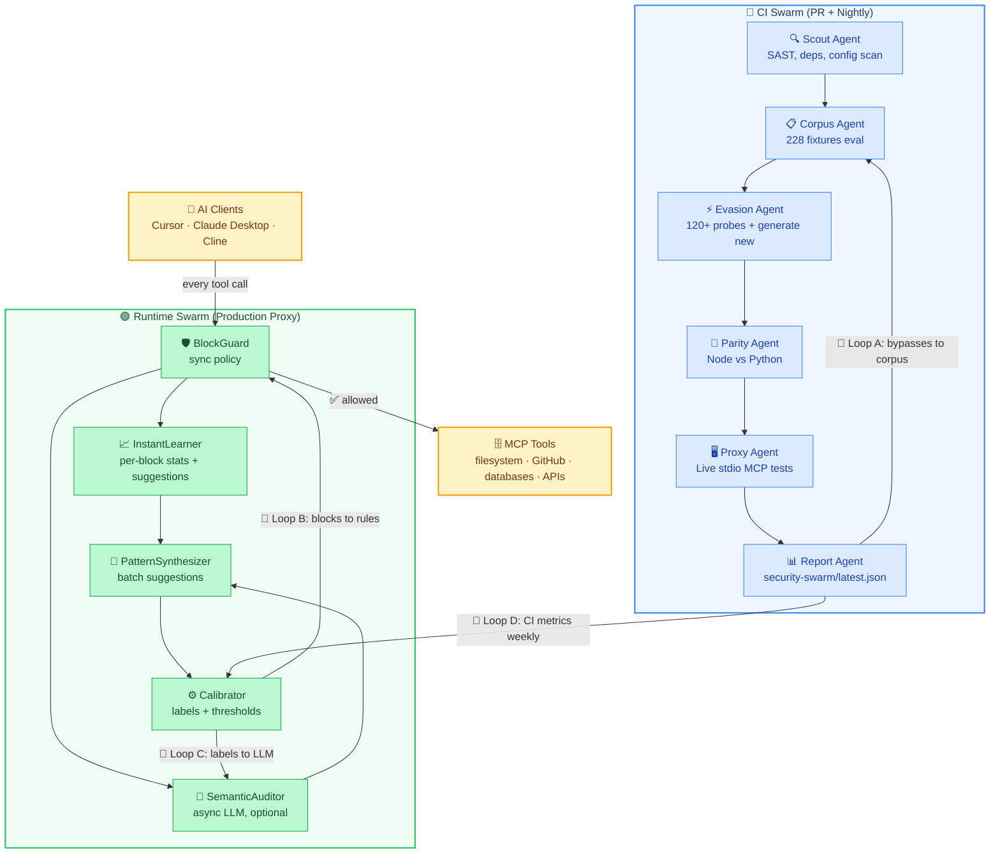

<p align="center">
  
</p>

<h1 align="center">mastyf.ai</h1>

<p align="center"><strong>Perimeter security for your AI.</strong></p>

<p align="center">Runtime enforcement, policy control, and full audit trail for every AI action.</p>

<p align="center">
  <a href="https://mastyf-ai-cloud-jet.vercel.app/">Website</a> ·
  <a href="#quick-start">Quick start</a> ·
  <a href="#policy">Policy</a> ·
  <a href="#dashboard">Dashboard</a> ·
  <a href="https://github.com/mastyf-ai/mastyf.ai">GitHub</a>
</p>

<p align="center">
  <a href="LICENSE"></a>
  <a href="https://github.com/mastyf-ai/mastyf.ai/actions"></a>
  <a href="coverage/lcov-report/index.html"></a>
  
</p>

---

## The problem

AI agents can read your files, push code, query your databases, and call external APIs. They do this autonomously, at speed, without asking permission.

There is no perimeter. No enforcement. No audit trail. Until now.

**mastyf.ai intercepts every tool call your AI makes, enforces your security policy, and blocks anything that violates it — before it executes.**

---

## What it stops

| Threat | What it looks like |
|--------|--------------------|
| Prompt injection | Malicious instructions embedded in tool arguments to hijack agent behavior |
| Path traversal | Attempts to access `/etc/passwd`, `.ssh/id_rsa`, `.aws/credentials` |
| Secret exfiltration | API keys and tokens leaking through tool arguments |
| Shell injection | Reverse shells, `rm -rf`, encoded PowerShell commands |
| Data exfiltration | Bulk SQL dumps, `git push`, `aws s3 cp`, unauthorized file transfers |
| SSRF | Calls to metadata endpoints, localhost, and private IP ranges |
| Encoding evasion | Base64 blobs and Unicode homoglyphs used to bypass pattern detection |
| Cost abuse | Runaway agent loops burning through token budgets |
| Rug-pull attacks | Tool definitions that silently change mid-session |

---

## How enforcement works

Every tool call passes through three layers before it reaches your infrastructure.

**Layer 1 - Pattern detection**
Regex-based scanning for injection, dangerous paths, leaked secrets, shell commands, and encoding tricks. Runs in microseconds with no external dependencies.

**Layer 2 - Schema validation**
Rejects malformed payloads, oversized arguments, and JSON-RPC violations before they reach policy evaluation.

**Layer 3 - Semantic review**
An optional local LLM (Ollama) or cloud model evaluates borderline calls that pass pattern checks. Falls back to heuristics if no model is configured.

Anything that fails is blocked. The tool never runs. Everything is logged.

---

## Quick start
 
### Docker
 
The easiest way to run mastyf.ai on any platform (Windows, macOS, or Linux).
 
**Requirements:** [Docker Desktop](https://www.docker.com/products/docker-desktop/)
 
```bash
git clone https://github.com/mastyf-ai/mastyf.ai.git
cd mastyf.ai
docker compose -f deploy/docker-compose.yml up -d --build
```
 
That's it. The proxy and dashboard are running at **http://localhost:4000** and Prometheus metrics at **http://localhost:9090/metrics**.
 
> **Note:** The audit history database is stored in a named Docker volume (`mastyf-ai-data`) and persists across restarts. Only `down -v` wipes it.
 
> **Security:** The dashboard has no auth by default (`DASHBOARD_AUTH_DISABLED=true`). Do not expose port 4000 publicly without enabling dashboard auth.
 
---

## Dashboard

Full visibility into every action your AI takes.

<!-- SCREENSHOT: Dashboard overview / main metrics view -->
<!-- Replace this comment with a screenshot of the main dashboard -->

| Section | What you see |
|---------|-------------|
| Protection | Block rate, top triggered rules, live threat feed |
| Activity | Every tool call with full arguments, allow or block status, timestamp |
| Policy | Live rule editor with hot-reload from YAML |
| Threat Lab | AI-suggested attack tests, reviewed and approved before anything applies |
| Cost | Token usage and cost estimates broken down per tool call |

<!-- SCREENSHOT: Activity log / audit trail -->
<!-- Replace this comment with a screenshot of the activity and audit log view -->

> Do not expose port 4000 publicly without enabling dashboard auth. The default local dev config has `DASHBOARD_AUTH_DISABLED=true`.

### Security Operations Dashboard


### Real Time Agent Activity 


---

## Policy

Your rules live in `default-policy.yaml`. You own them. mastyf.ai enforces them.

```yaml
policy:
  mode: block
  default_action: pass
  unicode_strict: true
  rules:
    - name: block-sensitive-paths
      action: block
      argPatterns:
        - field: path
          patterns: ['^/etc/', '/\.ssh', '/\.aws/credentials']

    - name: rate-limit-tool-calls
      action: block
      maxCallsPerMinute: 120

    - name: block-shell-injection
      action: block
      patterns: ['rm\s+-rf', 'curl\s', 'wget\s', '`[^`]+`']
```

Roll out safely with three enforcement modes:

| Mode | Behavior | When to use |
|------|----------|-------------|
| `audit` | Log everything, block nothing | First week, understand what your AI does |
| `warn` | Log and flag, still forwards | Tuning phase before enforcement |
| `block` | Stops violations before execution | Production |

Pre-built templates for HIPAA, PCI-DSS, GxP, and data residency are in [`policy-templates/`](policy-templates/).


---

## Architecture

mastyf.ai runs two coordinated swarms. The CI Swarm attacks your policy before code ships. The Runtime Swarm enforces and learns from every live tool call in production. Four feedback loops connect them so the system gets harder to bypass over time.



**Canonical gates:** 228/228 corpus, 0 bypasses, 100% parity

### CI Swarm

Runs on every PR and nightly. Six agents work in sequence, each one hardening what the previous found.

| Agent | What it does |
|-------|-------------|
| Scout | SAST scan, dependency audit, config review |
| Corpus | Evaluates all 228 attack fixtures against current policy |
| Evasion | Runs 120+ bypass probes and generates novel ones using an LLM |
| Parity | Verifies Node and Python implementations produce identical decisions |
| Proxy | Live stdio MCP session tests against a running proxy instance |
| Report | Writes `security-swarm/latest.json` with full results and metrics |

### Runtime Swarm

Runs inside the production proxy on every tool call.

| Component | What it does |
|-----------|-------------|
| BlockGuard | Enforces the active policy synchronously on every call. Fail-closed. |
| InstantLearner | Tracks per-block statistics and surfaces rule suggestions in real time |
| SemanticAuditor | Optional async LLM review for calls that clear pattern checks but look suspicious |
| PatternSynthesizer | Batches suggestions from InstantLearner and SemanticAuditor into candidate rules |
| Calibrator | Labels candidates, tunes thresholds, and promotes approved rules back into BlockGuard |

### Feedback loops

| Loop | Signal | Effect |
|------|--------|--------|
| A | CI bypass found | Added to corpus, CI now guards against it permanently |
| B | Runtime block pattern | Synthesized into a new rule, promoted to BlockGuard |
| C | Calibrator label | Used to fine-tune SemanticAuditor thresholds |
| D | CI metrics (weekly) | Updates runtime config — keeps CI and production in sync |

The proxy supports five transports: stdio, HTTP, SSE, streamable HTTP, and WebSocket.

For enterprise deployments with Redis, Postgres, and Kubernetes see [`docs/ENTERPRISE_DEPLOYMENT.md`](docs/ENTERPRISE_DEPLOYMENT.md).

---

## Threat Lab

Threat Lab watches live traffic and uses a local LLM to propose new attack test cases when it detects suspicious patterns. Nothing is applied automatically. You review and approve every suggestion in the dashboard before it becomes a rule.

Approved discoveries feed back into the CI attack corpus for ongoing regression testing.

```bash
ollama serve
ollama pull qwen3:8b

export OLLAMA_BASE_URL=http://127.0.0.1:11434
export MASTYF_AI_LLM_PROVIDER=ollama
export MASTYF_AI_LLM_MODEL=qwen3:8b

pnpm dashboard:proxy
```

<!-- SCREENSHOT: Threat Lab review queue -->
<!-- Replace this comment with a screenshot of the Threat Lab suggestion UI -->

---

## MCP package trust scores

Before installing any MCP server from npm, check its trust score at [mastyf-ai-cloud-jet.vercel.app](https://mastyf-ai-cloud-jet.vercel.app). Scores cover CVE exposure, typo-squat risk, maintainer signals, and known attack patterns. Free, no account required.

---

## Common commands

| Command | What it does |
|---------|-------------|
| `node dist/cli.js start` | Start proxy and dashboard on port 4000 |
| `node dist/cli.js onboard` | Wrap your MCP config to route through the proxy |
| `node dist/cli.js doctor` | Health check for DB, policy, and environment |
| `node dist/cli.js scan --all` | Scan MCP configs for CVEs and injection risks |
| `pnpm test` | Run the full test suite |
| `pnpm security-swarm:fast` | Quick security regression, 5 to 15 minutes |
| `pnpm security-swarm:analyze` | Full adversarial analysis |

---

## Troubleshooting

| Problem | Fix |
|---------|-----|
| Dashboard shows no data | Proxy and dashboard must share the same `MASTYF_AI_DB_PATH`. Default is `~/.mastyf-ai/history.db` |
| `dist/cli.js` not found | Run `pnpm build` |
| AI still hitting tools directly | Run `node dist/cli.js onboard --apply` |
| Ollama warnings at startup | Run `ollama serve` or remove `MASTYF_AI_LLM_PROVIDER` from your environment |
| npm install fails | npm publish is not live yet. Use `git clone` and `pnpm install` |

---

## Learn more

- [Enterprise deployment (Redis, Postgres, Helm)](docs/ENTERPRISE_DEPLOYMENT.md)
- [Defense pipeline in depth](docs/DEFENSE_FABRIC.md)
- [Security Swarm and CI red teaming](security-swarm/README.md)
- [Real-world MCP integration examples](docs/REAL_WORLD_INTEGRATION.md)
- [Core detection engine](packages/core/README.md)


