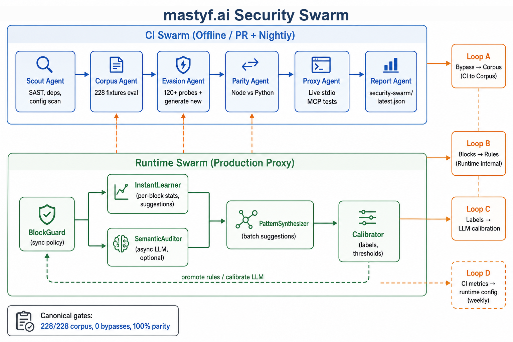

# Security Swarm

Closed-loop agentic workflow for Mastyff AI: scan vulnerabilities, evolve policy and LLM layers from real outcomes, and gate releases on corpus + harness evidence.

## Architecture



## Agents

| Agent | Mode | Role |
|-------|------|------|
| **Scout** | CI | `pnpm audit` supply-chain signal |
| **Corpus** | CI | 228-entry eval (`MASTYFF_AI_DISABLE_SEMANTIC=true pnpm eval`) |
| **Evasion** | Full | Custom probes + `evasion-generate.mjs` on net-new bypasses |
| **Threat Lab** | Optional (Pro) | LLM discovery via `threat-lab.mjs` when `SWARM_THREAT_LAB=true`; requires Ollama — no synthetic fallback |
| **Auto Threat Research** | Optional (Pro) | Direct `adv-*.json` writes via `auto-threat-research.mjs` when `SWARM_THREAT_RESEARCH_AUTO=true` + `MASTYFF_AI_THREAT_RESEARCH_AUTO=true` |
| **Parity** | CI | Node ↔ Python by fixture id |
| **Proxy** | Full | Live stdio MCP via adversarial-harness |
| **Learning-sim** | Full | `pnpm eval:attack-learning` |
| **Report** | CI | `reports/security-swarm/latest.json` |

## Runtime swarm (production)

Implemented in-process (not separate processes):

- **BlockGuard** — sync policy on every `tools/call`
- **InstantLearner** — `recordInstantBlockEvent`
- **SemanticAuditor** — `enqueueSemanticAudit` when `MASTYFF_AI_SEMANTIC_ASYNC=true`
- **PatternSynthesizer** — debounced `SuggestionEngine`
- **Calibrator** — `POST /api/learning/label` + `scripts/security-swarm/calibrate-semantic.ts`

## Quick start

### One-click analysis (recommended)

Single pipeline: live official filesystem MCP → calibration → swarm gates → **`reports/security-swarm/analysis.txt`** (detailed plain-text report). Progress is written to `reports/security-swarm/job.json`.

```bash
pnpm security-swarm:analyze       # fast swarm profile (~2–15 min total)
pnpm security-swarm:analyze:full  # nightly swarm profile (~45–90 min)
```

**Dashboard:** open the **Swarm** tab → **Run full security analysis** → poll progress → **Download analysis.txt**.

Flags (orchestrator `security-swarm/run-analysis.mjs`): `--skip-live`, `--skip-swarm`, `--quiet` (for API-triggered runs).

### Gate-only runs

```bash
# Live streaming (default on a TTY) — full visibility of each step
pnpm security-swarm:live          # nightly (~30–60 min)
pnpm security-swarm:fast          # PR gate (~5–15 min)

# CI / logs capture (no live child output)
pnpm security-swarm:ci

# Semantic calibration (7d labels)
pnpm security-swarm:calibrate
```

## Gates

See [`config/gates.json`](config/gates.json):

- Corpus: 100% attack block, 0 benign FP
- Parity: 100% corpus agreement
- Evasion: 0 **net-new** bypasses vs [`config/bypass-baseline.json`](config/bypass-baseline.json)

When a bypass is accepted as a known flake, add its fingerprint to the baseline manifest (do not weaken corpus thresholds).

## Human review — corpus fixture PRs

When the swarm detects net-new bypasses:

1. `evasion-generate.mjs` writes `adversarial-harness/fixtures/custom-attacks/adv-NNN.json` from corpus template mutation (real `toolName` / `arguments`).
2. Manifest: `reports/security-swarm/evasion-promotions.json` lists branches `swarm/corpus-adv-NNN`.
3. **Local (recommended):**
   ```bash
   node security-swarm/scripts/open-corpus-pr.mjs --dry-run   # plan
   node security-swarm/scripts/open-corpus-pr.mjs             # create branches
   git push -u origin swarm/corpus-adv-NNN
   gh pr create --head swarm/corpus-adv-NNN --title "Swarm corpus: adv-NNN" \
     --body "Human review. Run pnpm security-swarm:fast before merge."
   ```
4. **CI (optional):** workflow_dispatch [`.github/workflows/security-swarm-corpus-pr.yml`](../.github/workflows/security-swarm-corpus-pr.yml) — requires `contents: write`; default dry-run. **No auto-merge.**

After merge, add the bypass fingerprint to `config/bypass-baseline.json` if it remains an accepted known gap.

## Deployment profiles

Documented in [docs/AI_LEARNING.md](../docs/AI_LEARNING.md#deployment-profiles-security-swarm):

- `sync-only` — regex/semantic guards, no LLM latency
- `hybrid` — default enterprise (async semantic optional)
- `high-paranoia` — semantic async + instant LLM + strict quorum

## Reports

| Artifact | Schema / purpose |
|----------|------------------|
| [`analysis.txt`](../reports/security-swarm/analysis.txt) | **User-facing deep dive** — live MCP, learning, gates, recommendations (`pnpm security-swarm:analyze`) |
| [`job.json`](../reports/security-swarm/job.json) | Orchestrator progress (`state`, `phase`, `progressPct`) for CLI + dashboard |
| [`latest.json`](../reports/security-swarm/latest.json) | `findings`, `timings`, `bypasses`, `gates`, `commitSha` |
| [`summary.md`](../reports/security-swarm/summary.md) | Markdown gate table |
| [`swarm-report.txt`](../reports/security-swarm/swarm-report.txt) | Plain-text summary (+ stamped `report-{timestamp}.txt`) |
| [`calibration.json`](../reports/security-swarm/calibration.json) | Weekly semantic thresholds (`semantic-calibrate.yml`) |

## Workflows

| Workflow | Trigger |
|----------|---------|
| [`security-swarm.yml`](../.github/workflows/security-swarm.yml) | PR (fast), nightly (full) |
| [`semantic-calibrate.yml`](../.github/workflows/semantic-calibrate.yml) | Weekly Mon 08:00 UTC, manual |
| [`security-swarm-corpus-pr.yml`](../.github/workflows/security-swarm-corpus-pr.yml) | Manual only (corpus branches) |

## Verify

```bash
pnpm security-swarm:fast
node security-swarm/agents/report-synthesize.mjs
pnpm security-swarm:calibrate
pnpm vitest run tests/ai/semantic-audit-store.test.ts
```
